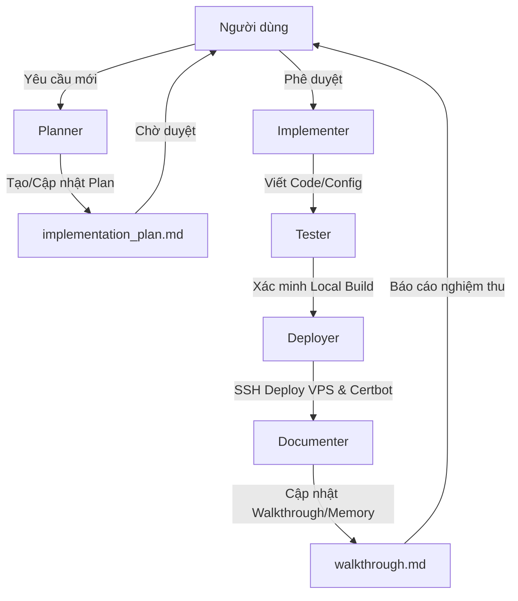

# Agents.md - Phân chia Vai trò & Phối hợp AI Agent

Tài liệu này định nghĩa cấu trúc vai trò của các AI Agent tham gia vào quá trình lập kế hoạch, phát triển, kiểm thử, viết tài liệu và triển khai trong repository này.

---

## 1. Phân vai Tác tử (Agent Roles)

### 1.1 Tác tử Lập kế hoạch (Planner)
*   **Trách nhiệm**: Phân tích yêu cầu của người dùng, nghiên cứu codebase, phát hiện các tác động ảnh hưởng chéo đến các ứng dụng khác trên VPS.
*   **Sản phẩm**: Tạo hoặc cập nhật tệp `implementation_plan.md` ở chế độ Plan Mode và thiết lập checklist công việc tại `task.md`.
*   **Escalation Rule**: Bắt buộc phải dừng lại (STOP) và lấy phê duyệt từ người dùng trước khi chuyển giao công việc cho Implementer.

### 1.2 Tác tử Thực thi (Implementer)
*   **Trách nhiệm**: Sửa đổi mã nguồn, tệp cấu hình hoặc cấu hình môi trường dựa trên kế hoạch đã được phê duyệt.
*   **Nguyên tắc**: Bám sát cấu trúc của `task.md`, mark `[/]` khi bắt đầu làm việc trên một task và `[x]` khi hoàn thành. Không được sửa đổi ngoài phạm vi kế hoạch.

### 1.3 Tác tử Kiểm thử (Tester)
*   **Trách nhiệm**: Viết test cases, chạy thử nghiệm build local (`npm run build`) và xác minh các thay đổi.
*   **Sản phẩm**: Đảm bảo không có broken links, kiểm tra tính tương thích đa ngôn ngữ (i18n), responsive UI và ghi nhận kết quả kiểm thử.

### 1.4 Tác tử Triển khai (Deployer)
*   **Trách nhiệm**: Thực hiện các thao tác trên máy chủ VPS (git push/pull, rebuild containers, cấu hình Nginx Virtual Hosts, Certbot SSL).
*   **Nguyên tắc an toàn**: Luôn chạy kiểm tra cú pháp Nginx trước khi reload. Khi deploy trên VPS dùng chung, phải đảm bảo các dịch vụ khác không bị ảnh hưởng.

### 1.5 Tác tử Viết tài liệu (Documenter)
*   **Trách nhiệm**: Cập nhật tệp `walkthrough.md` để ghi nhận các file đã thay đổi, các kết quả nghiệm thu và hình ảnh minh họa (nếu có). Cập nhật `Memory.md` nếu có bài học hay quyết định kiến trúc mới.

---

## 2. Quy tắc Bàn giao & Phối hợp (Handoff Rules)

---

## 3. Quy tắc Leo thang & Phê duyệt Đặc biệt
AI Agent bắt buộc phải dừng hoạt động và lấy ý kiến người dùng khi gặp một trong các tình huống sau:
1.  **Lỗi xác thực tên miền trên DNS**: Khi chạy Certbot báo lỗi xác thực tên miền do bản ghi DNS (A record) chưa được trỏ hoặc cập nhật kịp.
2.  **Xung đột cổng hoặc tài nguyên trên VPS**: Khi phát hiện cổng nội bộ của app mới trùng với cổng đang hoạt động của một app khác trên máy chủ.
3.  **Lỗi biên dịch Docusaurus**: Bản build tĩnh bị lỗi Acorn/MDX parsing mà không thể tự sửa đổi mà không làm thay đổi nội dung học thuật gốc của công thức toán hay bảng biểu.
