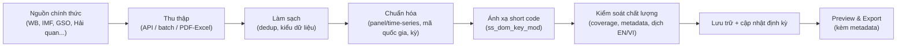

import Head from '@docusaurus/Head';

export const methodSchema = {
  '@context': 'https://schema.org',
  '@type': 'TechArticle',
  '@id': 'https://docs.tnsai.vn/ecodata/du-lieu/methodology#article',
  headline: 'EcoData data methodology',
  description:
    'How EcoData collects, cleans, standardizes, quality-controls and updates economic and financial data, including limitations and reproducibility principles.',
  url: 'https://docs.tnsai.vn/ecodata/du-lieu/methodology',
  inLanguage: ['vi', 'en'],
  author: { '@type': 'Organization', name: 'EcoData', url: 'https://ecodata.io.vn/' },
  publisher: { '@type': 'Organization', name: 'EcoData', url: 'https://ecodata.io.vn/' },
  about: ['data aggregation', 'data cleaning', 'standardization', 'metadata', 'reproducibility'],
};

<Head>
  
</Head>

# Phương pháp luận dữ liệu (Methodology)

EcoData không tạo ra số liệu gốc. Vai trò của nền tảng là **tổng hợp, làm sạch và chuẩn hóa** dữ liệu từ các nguồn chính thức về một định dạng thống nhất, có metadata, sẵn sàng cho phân tích và công bố. Trang này mô tả minh bạch quy trình đó để người dùng đánh giá được độ tin cậy và giới hạn của dữ liệu.

## Quy trình tổng thể

## 1. Thu thập dữ liệu

EcoData dùng nhiều cơ chế thu thập tùy đặc thù nguồn:

- **API trực tiếp**: chuẩn SDMX cho IMF, Eurostat, OECD, ILO; REST cho World Bank, FAO, OWID; nguồn cần khóa truy cập cho FRED, WTO, UNCTAD, ADB.
- **Nạp theo lô (batch)**: tệp CSV/XLSX cho một số bộ chỉ tiêu lớn (ví dụ ADB, IMF datasets).
- **Niên giám & báo cáo PDF/Excel**: dữ liệu GSO (KTXH, NGTK-CN, NGTK-TINH) và báo cáo Hải quan được trích xuất có kiểm soát.
- **Khảo sát & vi mô**: PCI, PAPI, PAR, SIPAS, ICT theo tỉnh-năm; vi mô VHLSS/VARHS/VES nạp theo wave.
- **Chứng khoán**: giá, báo cáo tài chính, thuyết minh và lịch sự kiện doanh nghiệp niêm yết.

## 2. Làm sạch dữ liệu

- **Khử trùng lặp** bản ghi và chuẩn hóa kiểu dữ liệu (số, ngày, chuỗi).
- **Chuẩn định danh**: mã quốc gia, mã tỉnh, mã mặt hàng; gắn khóa kỳ chuẩn (`Q1`–`Q4`, `M01`–`M12`).
- **Loại chỉ tiêu rỗng/thiếu phạm vi**: các chuỗi không có `time_start`/`time_end` hợp lệ (hoặc `time_end <= time_start`) bị ẩn khỏi catalogue công khai để giảm nhiễu.

## 3. Chuẩn hóa

- **Định dạng panel / time-series** nhất quán theo đơn vị phân tích (quốc gia, tỉnh, doanh nghiệp, hộ, cá nhân).
- **Ánh xạ short code** `ss_dom_key_mod` để hợp nhất tên chỉ tiêu giữa các nguồn — xem [Từ điển dữ liệu](/ecodata/du-lieu/data-dictionary).
- **Giữ nguyên đơn vị gốc** trong metadata; không tự quy đổi đơn vị nếu nguồn không cung cấp.

## 4. Kiểm soát chất lượng

- **Metadata bắt buộc**: mỗi chỉ tiêu phải có nhãn, đơn vị, tần suất, nguồn và phạm vi thời gian.
- **Kiểm tra coverage**: theo năm, tần suất, địa bàn và độ đầy đủ trước khi đưa vào catalogue.
- **Song ngữ EN/VI**: nhãn được dịch và rà soát; nhãn nguồn quá ngắn (dễ mất ngữ cảnh khi dịch máy) được đánh dấu để rà soát thủ công.

## 5. Cập nhật

Dữ liệu được làm mới theo lịch (cron/CI) tùy nguồn — ví dụ nạp dữ liệu quốc tế, nhập dữ liệu chứng khoán, đồng bộ lịch sự kiện. Một số tác vụ nạp lớn chạy nền và có cơ chế phát hiện "job treo" để bảo đảm trạng thái nhất quán.

## 6. Giới hạn cần lưu ý

- **Khác biệt định nghĩa giữa nguồn**: cùng tên "GDP" hay "lạm phát" có thể khác cách tính giữa WB, IMF, GSO — luôn đọc metadata.
- **Khoảng trống coverage**: không phải chỉ tiêu nào cũng đủ năm/địa bàn cho mọi mẫu nghiên cứu.
- **Ghép panel đa nguồn**: cần đồng nhất đơn vị, tần suất và đơn vị phân tích trước khi gộp.
- **Dữ liệu vi mô**: VHLSS micro có phân quyền truy cập theo gói; bản ghi gốc được giữ nguyên, EcoData cung cấp lớp tra cứu/biên mục.

## 7. Tái lập và trích dẫn

- Mọi lần xuất đi kèm **metadata + short code** để tái lập và dẫn nguồn minh bạch.
- Công cụ [Kinh tế lượng](/ecodata/cong-cu/econometrics) sinh **bộ mã đầy đủ (Stata/R/Python)** từ bước chọn dữ liệu đến báo cáo, giúp tái lập toàn bộ quy trình phân tích.

## Xem thêm

- [Từ điển dữ liệu (Data Dictionary)](/ecodata/du-lieu/data-dictionary)
- [Phân nhóm nguồn dữ liệu](/ecodata/nguon-du-lieu/phan-nhom-nguon-du-lieu)
- [Xuất dữ liệu & giới hạn gói](/ecodata/xuat-du-lieu/preview-export)
