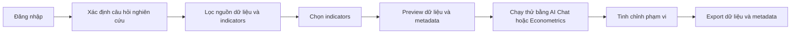

# Tổng quan Khai thác Ecodata

Ecodata là nền tảng khai thác dữ liệu kinh tế phục vụ nghiên cứu, phân tích chính sách và mô hình định lượng. Ứng dụng hiện tập trung vào ba việc chính: tìm đúng nguồn dữ liệu, chọn đúng indicators, và xuất bộ dữ liệu có metadata để người dùng có thể kiểm tra lại quy trình nghiên cứu.

Tài liệu này thay thế cấu trúc hướng dẫn cũ bằng các bài viết theo flow thao tác trong ứng dụng. Người dùng mới nên bắt đầu từ bài [Login → Filter/Select → Preview → Export](/ecodata/bat-dau/login-filter-preview-export), sau đó đọc chi tiết từng nhóm indicators.

## Điểm nổi bật

- **Dữ liệu sạch, sẵn sàng công bố:** được làm sạch và chuẩn hóa theo định dạng panel/time-series, sẵn sàng cho nghiên cứu và công bố quốc tế (*ready to publication*).
- **Phong phú và cập nhật:** kho dữ liệu đa lĩnh vực, đa nguồn, được cập nhật thường xuyên.
- **Đầy đủ chỉ số vĩ mô quốc tế:** từ các nguồn chính thức — World Bank, IMF, ADB, UN, FRED, OECD, ILO...
- **Dữ liệu chính thức của Việt Nam:** Tổng cục Thống kê (Niên giám thống kê, Báo cáo kinh tế – xã hội), Tổng cục Hải quan (báo cáo và dữ liệu xuất nhập khẩu theo mặt hàng), dữ liệu khảo sát (PAPI, PCI, PAR, SIPAS, ICT) và các bộ vi mô VHLSS, VARHS, VES.

## Bộ công cụ truy xuất dữ liệu EcoData

EcoData không chỉ hỗ trợ tải dữ liệu trên trình duyệt. Người dùng có thể tạo **khóa API cá nhân** trong Dashboard và truy xuất cùng một nguồn dữ liệu thật qua bộ công cụ Excel / Python / Stata / R. Các client này gọi chung bề mặt **Public SDMX API** tại `/api/v1/sdmx`, nên cùng một chuỗi dữ liệu có thể được tái lập giữa nhiều phần mềm nghiên cứu.

| Công cụ | Cách dùng chính | Trạng thái phát hành trung thực |
| --- | --- | --- |
| Excel | Sideload manifest self-host `https://ecodata.io.vn/excel/manifest.xml`, dùng task pane hoặc hàm `=ECODATA.SERIES(...)` | Route self-host và data layer production đã xác minh; AppSource và kiểm thử runtime Excel Win/Web thủ công vẫn đang chờ. |
| Python | `EcoData().series(...)` trả về `pandas.DataFrame` dạng tidy | Core package và live smoke production đã xác minh; phát hành PyPI đang chờ. |
| Stata | `net install ecodata, from("https://ecodata.io.vn/clients/stata") replace`, sau đó dùng `ecodata use ...` | Route self-host và live smoke production đã xác minh; nộp SSC đang chờ. |
| R | `eco_series(...)` trả về `tibble` dạng tidy | Core package và live smoke production đã xác minh; phát hành CRAN đang chờ. |

Các dataflow hiện dùng cho client gồm `MACRO_INTL`, `GSO_VN`, `CUSTOMS_VN` và `STOCK_VN`. Khi làm nghiên cứu thật, nên lưu khóa API trong biến môi trường hoặc `~/.ecodata`, giữ metadata/short code cùng dữ liệu đã tải, và thu hồi khóa khi dự án kết thúc.

## Nhóm chức năng chính

| Nhóm | Module trong app | Người dùng làm gì |
| --- | --- | --- |
| Global Data | Dashboard, Export Panel | Tìm indicators quốc tế từ World Bank, IMF, OECD, Eurostat, ILO, FAO, WTO, ADB và các nguồn liên quan. |
| GSO Việt Nam | GSO Explorer | Khai thác KTXH, NGTK-CN, NGTK-TINH và VHLSS aggregate theo năm, tỉnh, nhóm chỉ tiêu. |
| Hải quan | Customs Explorer | Lọc báo cáo xuất nhập khẩu theo hàng hóa, quốc gia, tỉnh, phương thức vận tải và kỳ báo cáo. |
| Macro Survey | Survey Explorer | Tìm PCI, PAPI, ICT, PAR, SIPAS theo tỉnh và năm. |
| VHLSS Micro | Variable Hub | Chọn wave, dataset, biến vi mô, preview record và tạo bộ dữ liệu panel/pooled. |
| Stock Hub | Stocks | Xem giá, hồ sơ mã, báo cáo tài chính, thuyết minh và lịch sự kiện. |
| AI Chat | Chat | Nhờ AI gợi ý indicators, nguồn dữ liệu, biến mô hình và truy vấn dữ liệu. |
| Econometrics | Analysis | Chạy thử OLS, WLS, GLS, panel, VAR, ARIMA, Logit, Probit trước khi export chính thức. |

## Flow chuẩn cho người nghiên cứu

## Nguyên tắc chọn indicators

1. Chọn nguồn theo đơn vị phân tích trước: quốc gia, tỉnh, doanh nghiệp, hàng hóa, hộ gia đình hoặc cá nhân.
2. Kiểm tra coverage theo năm, tần suất, địa bàn và độ đầy đủ trước khi thêm vào export.
3. Đọc metadata để xác nhận định nghĩa, đơn vị đo, phương pháp tính và nguồn gốc.
4. Preview dữ liệu mẫu trước khi tải toàn bộ, nhất là khi dùng dữ liệu panel hoặc nhiều nguồn.
5. Lưu citation, short code và metadata cùng dữ liệu để tái lập kết quả.

## Trạng thái triển khai tài liệu

Bộ tài liệu hiện ưu tiên tiếng Việt. Các chuỗi UI của trang chủ được quản lý bằng `src/i18n/vi.json` và `src/i18n/en.json`; nội dung bài viết dùng cơ chế i18n theo file của Docusaurus khi cần mở rộng bản tiếng Anh đầy đủ.
