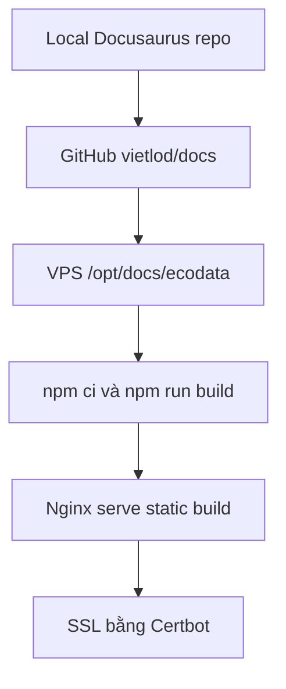

# Kế hoạch tích hợp Docusaurus và VPS

Repo tài liệu đã được chuẩn hóa theo Docusaurus để phục vụ app "Khai thác Ecodata". Mục tiêu triển khai là đồng bộ local repo, GitHub repo và thư mục tài liệu trên VPS, sau đó cấu hình domain, Nginx và SSL.

## Trạng thái local

| Hạng mục | Trạng thái |
| --- | --- |
| Local repo | `D:\DOCS\ecodata` |
| GitHub repo | `https://github.com/vietlod/docs` |
| App name | Khai thác Ecodata |
| Nội dung mặc định | Tiếng Việt |
| Target docs domain | `ecodata.tnsai.vn` |
| Domain app tham chiếu tính năng | `ecodata.io.vn` |
| VPS path dự kiến | `/opt/docs/ecodata` |

## Checklist trước khi deploy

1. Xác nhận domain cuối cùng cho docs và app.
2. Xác nhận DNS A record đã trỏ về VPS.
3. SSH vào VPS và kiểm tra thư mục `/opt/docs`.
4. Kiểm tra port đang dùng bằng `ss -tulpn`.
5. Kiểm tra Nginx sites-enabled/sites-available.
6. Kiểm tra container/app Ecodata đang chạy để tránh đụng port.
7. Build Docusaurus ở local hoặc trên VPS.
8. Chỉ cấu hình SSL sau khi domain đã resolve đúng.

## Phương án triển khai khuyến nghị

## Nginx

Nginx nên serve static build của Docusaurus, không cần chạy dev server. Cấu hình cần tách riêng khỏi app Ecodata production để không ảnh hưởng các service đang dùng port backend, frontend, Redis, adapter hoặc Python service.

## Phạm vi không tác động

Domain `ecodata.io.vn` là domain của app Ecodata production và chỉ dùng để tham chiếu tính năng. Quá trình triển khai tài liệu không thay đổi code, container, Nginx block hoặc thư mục `/opt/ecodata` của app.
