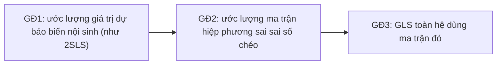

# 3SLS — Bình phương nhỏ nhất ba giai đoạn

**3SLS (Three-Stage Least Squares)** ước lượng một **hệ phương trình đồng thời (simultaneous equations)** trong đó các biến nội sinh xuất hiện ở nhiều phương trình và **sai số tương quan chéo** giữa các phương trình. 3SLS kết hợp [2SLS](/ecolab/mo-hinh/iv-2sls) (xử lý nội sinh) với [GLS](/ecolab/mo-hinh/gls) (khai thác tương quan chéo) ⇒ hiệu quả hơn 2SLS từng phương trình.

:::tip Khi nào dùng
Dùng 3SLS khi mô hình là **hệ nhiều phương trình cấu trúc** có nội sinh (vd cung–cầu, hệ kinh tế vĩ mô) và sai số các phương trình tương quan. Nếu chỉ 1 phương trình ⇒ dùng 2SLS.
:::

---

## Ba giai đoạn

---

## Thực hiện trong EcoLab

1. Module **Mô hình hóa** → họ *IV & hệ phương trình* → **3SLS**.
2. Khai báo **các phương trình** của hệ, biến nội sinh và công cụ chung.
3. Chạy, đọc hệ số toàn hệ; so sánh với 2SLS từng phương trình; xuất **mã tái lập**.

---

## Hạn chế

- **Sai đặc tả một phương trình** có thể lan sang toàn hệ (kém vững hơn ước lượng từng phương trình).
- Cần nhận dạng (identification) đầy đủ cho mọi phương trình.

## Xem thêm

- [IV/2SLS](/ecolab/mo-hinh/iv-2sls) · [SUR](/ecolab/mo-hinh/sur) · [Danh mục](/ecolab/mo-hinh/danh-muc)
