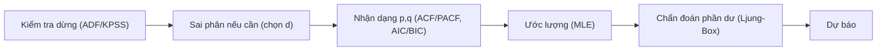

# AR / MA / ARMA / ARIMA — Họ Box-Jenkins

Đây là họ mô hình **chuỗi thời gian đơn biến** kinh điển để mô tả và **dự báo** một chuỗi dựa trên chính quá khứ của nó:

- **AR(p)** — Autoregressive: $Y_t$ phụ thuộc các giá trị trễ của chính nó.
- **MA(q)** — Moving Average: $Y_t$ phụ thuộc các sai số (cú sốc) trễ.
- **ARMA(p,q)** — kết hợp AR và MA cho chuỗi **dừng**.
- **ARIMA(p,d,q)** — thêm **sai phân bậc $d$** để xử lý chuỗi **không dừng**.

:::tip Khi nào dùng
Dùng cho **dự báo một chuỗi** (doanh thu, lạm phát, giá). Kiểm tra **tính dừng** trước (ADF/KPSS); nếu không dừng, lấy sai phân (bậc $d$) ⇒ ARIMA. Có mùa vụ ⇒ [SARIMA](/ecolab/mo-hinh/sarima); có biến động cụm ⇒ [GARCH](/ecolab/mo-hinh/garch).
:::

---

## Đặc tả mô hình

ARMA(p,q):

$$
Y_t = c + \sum_{i=1}^{p} \phi_i Y_{t-i} + \varepsilon_t + \sum_{j=1}^{q} \theta_j \varepsilon_{t-j}
$$

ARIMA(p,d,q): áp dụng ARMA(p,q) cho chuỗi đã sai phân $d$ lần $\Delta^d Y_t$.

---

## Quy trình Box-Jenkins

---

## Thực hiện trong EcoLab

1. Module **Mô hình hóa** → họ *Chuỗi thời gian đơn biến* → **ARIMA**.
2. Chọn chuỗi $Y$; khai báo $(p,d,q)$ hoặc dùng auto-ARIMA (AIC/BIC).
3. Chạy; xem chẩn đoán phần dư + **dự báo** kèm khoảng tin cậy; xuất **mã tái lập**.

## Hạn chế

- Giả định quan hệ **tuyến tính** và cấu trúc ổn định; kém khi có gãy cấu trúc.
- Không mô hình hóa **phương sai thay đổi theo thời gian** ⇒ dùng ARCH/GARCH.

## Xem thêm

- [SARIMA](/ecolab/mo-hinh/sarima) · [GARCH](/ecolab/mo-hinh/garch) · [ARDL](/ecolab/mo-hinh/ardl) · [Danh mục](/ecolab/mo-hinh/danh-muc)
