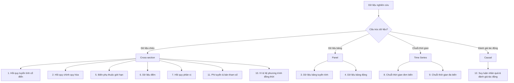
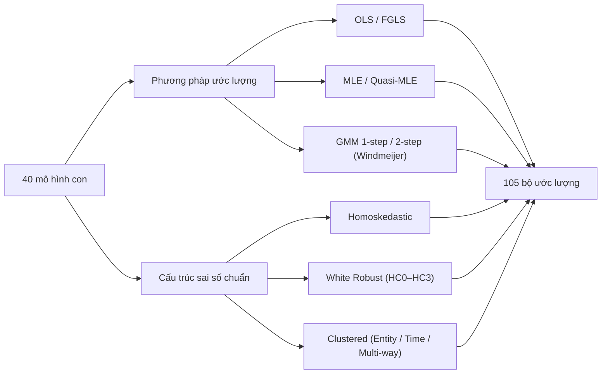
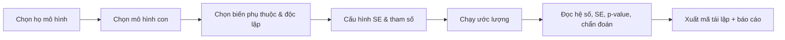

# Danh mục mô hình & ước lượng kinh tế lượng

EcoData/EcoLab tích hợp một **Econometrics Engine** toàn diện gồm **12 họ mô hình lớn**, phân rã thành **40 mô hình con** và **105 bộ ước lượng (estimators)**. Trang này là bản đồ tổng quan: giúp bạn chọn đúng họ mô hình theo cấu trúc dữ liệu và câu hỏi nghiên cứu, đồng thời hiểu cách 105 bộ ước lượng được hình thành.

:::tip Đánh giá khả thi trước khi đầu tư sâu
Chạy thử ngay trên dữ liệu thật để xác nhận đề tài **có dữ liệu, có ý nghĩa thống kê và có thể tái lập** trước khi viết luận văn hay bài báo. Mọi ước lượng đều xuất được **mã tái lập** Stata/R/Python.
:::

---

## Bản đồ 12 họ mô hình

---

## Bảng phân loại 12 họ → mô hình con

| # | Họ mô hình | Mô hình con tiêu biểu | Khi nào dùng |
| :--- | :--- | :--- | :--- |
| 1 | **Hồi quy tuyến tính cổ điển** | OLS, WLS, GLS, TLS | Quan hệ tuyến tính, dữ liệu chéo cơ sở |
| 2 | **Hồi quy chính quy hóa** | Ridge, Lasso, Elastic Net, Adaptive Lasso | Nhiều biến, đa cộng tuyến, chọn biến |
| 3 | **Dữ liệu bảng tuyến tính** | Pooled OLS, [Fixed Effects](/ecolab/mo-hinh/fem-rem), [Random Effects](/ecolab/mo-hinh/fem-rem), Between | Nhiều đơn vị × nhiều kỳ |
| 4 | **Dữ liệu bảng động** | [Arellano-Bond (Diff GMM)](/ecolab/mo-hinh/gmm), [Blundell-Bond (System GMM)](/ecolab/mo-hinh/gmm) | Có biến trễ, nội sinh, N lớn T nhỏ |
| 5 | **Biến phụ thuộc giới hạn** | Logit, Probit, Tobit, Truncated, Heckman | Biến nhị phân, bị chặn, chọn mẫu |
| 6 | **Dữ liệu đếm** | Poisson, Negative Binomial, ZIP, ZINB | Biến đếm (số nguyên không âm) |
| 7 | **Hồi quy phân vị** | Linear Quantile, Panel FE-QR | Tác động ở các phân vị khác nhau |
| 8 | **Chuỗi thời gian đơn biến** | AR, MA, ARMA, ARIMA, SARIMA, ARCH, GARCH, EGARCH | Dự báo, biến động một chuỗi |
| 9 | **Chuỗi thời gian đa biến** | [VAR](/ecolab/mo-hinh/vecm), [VECM](/ecolab/mo-hinh/vecm), SVAR | Hệ nhiều biến, đồng liên kết |
| 10 | **IV & hệ phương trình** | IV/2SLS, 3SLS, SUR | Nội sinh, hệ phương trình |
| 11 | **Phi tuyến & bán tham số** | NLS, GAM | Quan hệ phi tuyến |
| 12 | **Suy luận nhân quả** | [DiD](/ecolab/mo-hinh/did), PSM, RDD | Đánh giá tác động chính sách |

> Ngoài ra, [ARDL](/ecolab/mo-hinh/ardl) (Autoregressive Distributed Lag) hỗ trợ quan hệ dài hạn/ngắn hạn cho chuỗi thời gian có bậc tích hợp hỗn hợp I(0)/I(1).

---

## 105 bộ ước lượng được hình thành như thế nào?

**40 mô hình con** tương ứng với các **đặc tả toán học** khác nhau. Để phục vụ nghiên cứu học thuật đòi hỏi tính vững của hệ số, mỗi mô hình con có thể kết hợp với nhiều **phương pháp tối ưu hóa** và **cấu trúc sai số chuẩn** — tạo thành **105 bộ ước lượng**.

| Thành phần | Lựa chọn |
| :--- | :--- |
| **Phương pháp tối ưu hóa** | OLS, FGLS, Maximum Likelihood (MLE), Quasi-MLE, GMM (1-step/2-step với hiệu chỉnh Windmeijer) |
| **Cấu trúc sai số chuẩn** | Homoskedastic; White Robust (HC0, HC1, HC2, HC3); Clustered theo Entity, Time hoặc Multi-way |

:::info Sai số chuẩn vững (robust standard errors)
Việc chọn đúng cấu trúc sai số chuẩn giúp kiểm soát **phương sai sai số thay đổi (heteroskedasticity)** và **tự tương quan (autocorrelation)** — yếu tố quyết định tính tin cậy của suy diễn thống kê (t-stat, p-value, khoảng tin cậy).
:::

---

## Quy trình chạy ước lượng

1. Tại module **Mô hình hóa**, chọn **họ mô hình** theo cấu trúc dữ liệu.
2. Chọn **mô hình con** (đặc tả cụ thể).
3. Khai báo biến phụ thuộc $Y$ và các biến độc lập $X_1, \dots, X_k$.
4. Chọn **cấu trúc sai số chuẩn** (Homoskedastic / Robust / Clustered) và tham số nâng cao.
5. Chạy và đọc **bảng ước lượng**, **chẩn đoán khuyết tật**, **độ vững**; xuất **mã tái lập**.

---

## Cách chọn mô hình theo dữ liệu

| Cấu trúc dữ liệu | Họ mô hình ưu tiên |
| :--- | :--- |
| Dữ liệu chéo (cross-section), $Y$ liên tục | Hồi quy tuyến tính cổ điển; chính quy hóa nếu nhiều biến |
| $Y$ nhị phân / rời rạc / bị chặn | Biến phụ thuộc giới hạn; dữ liệu đếm |
| Dữ liệu bảng (N đơn vị × T kỳ) | Bảng tuyến tính (FE/RE); bảng động (GMM) nếu có biến trễ |
| Chuỗi thời gian một biến | ARIMA/SARIMA; ARCH/GARCH cho biến động |
| Hệ nhiều chuỗi thời gian | VAR/VECM/SVAR |
| Đánh giá tác động chính sách | DiD, PSM, RDD, IV |

---

## Xem thêm

- [Ước lượng & Mô hình hóa](/ecolab/econometrics-modeling) — quy trình thực hiện chi tiết
- Trang chi tiết theo họ: [Dữ liệu bảng (FEM/REM)](/ecolab/mo-hinh/fem-rem) · [Bảng động (GMM)](/ecolab/mo-hinh/gmm) · [ARDL](/ecolab/mo-hinh/ardl) · [VECM](/ecolab/mo-hinh/vecm) · [DiD](/ecolab/mo-hinh/did)
- Ví dụ thực nghiệm: [FDI & tăng trưởng (ARDL)](/ecolab/vi-du/fdi-tang-truong-ardl) · [Nợ công & tăng trưởng (panel)](/ecolab/vi-du/no-cong-tang-truong-panel)
