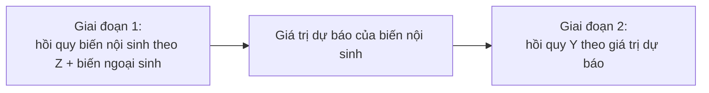

# IV / 2SLS — Biến công cụ & bình phương nhỏ nhất hai giai đoạn

**IV/2SLS** xử lý **nội sinh (endogeneity)** — khi biến giải thích tương quan với sai số (do biến bị bỏ sót, sai số đo lường, hoặc đồng thời). Khi đó [OLS](/ecolab/mo-hinh/ols) **chệch và không nhất quán**. IV dùng **biến công cụ (instrument)** để tách phần ngoại sinh của biến nội sinh.

:::warning Điều kiện biến công cụ hợp lệ
Một công cụ $Z$ hợp lệ phải: (1) **liên quan (relevance)** — tương quan với biến nội sinh; (2) **ngoại sinh (exogeneity/exclusion)** — chỉ ảnh hưởng $Y$ **qua** biến nội sinh, không trực tiếp. Công cụ yếu (weak instrument) gây ước lượng chệch nặng.
:::

---

## Cơ chế 2 giai đoạn

$$
\hat{\beta}_{2SLS} = (X' P_Z X)^{-1} X' P_Z Y, \qquad P_Z = Z(Z'Z)^{-1}Z'
$$

---

## Kiểm định bắt buộc

- **Công cụ yếu**: thống kê F giai đoạn 1 (kinh nghiệm: F > 10).
- **Nội sinh**: kiểm định Durbin-Wu-Hausman (có cần IV không?).
- **Overidentification**: kiểm định Sargan/Hansen J (khi số công cụ > số biến nội sinh).

---

## Thực hiện trong EcoLab

1. Module **Mô hình hóa** → họ *IV & hệ phương trình* → **IV/2SLS**.
2. Khai báo $Y$, biến ngoại sinh, **biến nội sinh** và **biến công cụ** $Z$.
3. Chạy, đọc F giai đoạn 1, hệ số 2SLS, Sargan/Hansen; xuất **mã tái lập**.

---

## Hạn chế

- **Công cụ yếu/không hợp lệ** làm IV tệ hơn OLS.
- Tìm công cụ tốt thường khó; cần lập luận lý thuyết vững.

## Xem thêm

- [3SLS](/ecolab/mo-hinh/3sls) · [SUR](/ecolab/mo-hinh/sur) · [Danh mục](/ecolab/mo-hinh/danh-muc)
