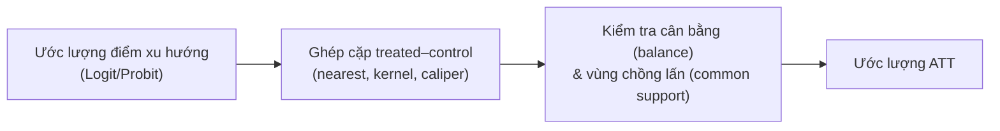

# PSM — Propensity Score Matching

**PSM (Propensity Score Matching)** đánh giá **tác động của can thiệp** trên dữ liệu quan sát bằng cách **ghép cặp** mỗi đối tượng **xử lý (treated)** với đối tượng **đối chứng (control)** có **điểm xu hướng (propensity score)** — xác suất tham gia ước lượng từ các biến quan sát — tương tự nhau. Mục tiêu: mô phỏng thí nghiệm ngẫu nhiên, giảm thiên lệch chọn lọc theo **biến quan sát được**.

:::warning Giả định then chốt
PSM dựa trên **selection on observables (CIA)**: mọi yếu tố ảnh hưởng cả việc tham gia lẫn kết quả đều **quan sát được**. Nếu có biến gây nhiễu **không quan sát được**, PSM vẫn chệch (khác [IV](/ecolab/mo-hinh/iv-2sls)/[DiD](/ecolab/mo-hinh/did) xử lý được phần nào yếu tố không quan sát).
:::

---

## Quy trình

Điểm xu hướng $p(X) = P(\text{treat}=1 \mid X)$ ước lượng bằng [Logit](/ecolab/mo-hinh/logit)/[Probit](/ecolab/mo-hinh/probit).

---

## Thực hiện trong EcoLab

1. Module **Mô hình hóa** → họ *Suy luận nhân quả* → **PSM**.
2. Khai báo biến xử lý, biến kết quả, biến nền (covariates); chọn thuật toán ghép cặp.
3. Chạy; kiểm tra **balance** + common support; đọc **ATT**; xuất **mã tái lập**.

## Hạn chế

- Không xử lý **nhiễu không quan sát được**.
- Nhạy với lựa chọn thuật toán ghép cặp; cần kiểm tra cân bằng kỹ.

## Xem thêm

- [DiD](/ecolab/mo-hinh/did) · [RDD](/ecolab/mo-hinh/rdd) · [Danh mục](/ecolab/mo-hinh/danh-muc)
