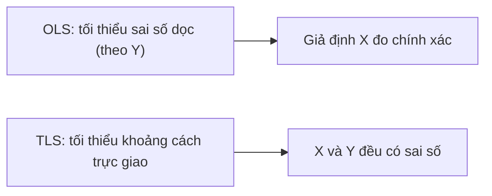

# TLS — Bình phương nhỏ nhất toàn phần

**TLS (Total Least Squares)** — còn gọi là hồi quy trực giao — xử lý trường hợp **cả biến độc lập $X$ lẫn biến phụ thuộc $Y$ đều có sai số đo lường** (errors-in-variables). Trong khi [OLS](/ecolab/mo-hinh/ols) chỉ tối thiểu hóa sai số theo phương $Y$, TLS tối thiểu hóa **khoảng cách trực giao** từ điểm dữ liệu đến đường hồi quy.

:::tip Khi nào dùng
Dùng TLS khi $X$ **không đo lường chính xác** (sai số đo). OLS khi đó cho hệ số **chệch về 0 (attenuation bias)**; TLS giảm thiểu vấn đề này.
:::

---

## Trực giác

OLS tối thiểu $\sum (Y_i - \hat{Y}_i)^2$ (theo trục $Y$); TLS tối thiểu tổng **bình phương khoảng cách vuông góc** từ điểm $(X_i, Y_i)$ tới đường hồi quy.

---

## Đặc tả mô hình

Với mô hình errors-in-variables: $Y_i = \beta_0 + \beta_1 X_i^{*} + \varepsilon_i$ nhưng ta chỉ quan sát $X_i = X_i^{*} + u_i$ (có nhiễu $u_i$). TLS ước lượng $\beta$ qua phân rã giá trị suy biến (SVD) của ma trận dữ liệu mở rộng $[X \mid Y]$.

---

## Thực hiện trong EcoLab

1. Module **Mô hình hóa** → họ *Hồi quy tuyến tính cổ điển* → **TLS**.
2. Chọn $Y$ và các $X$ nghi có sai số đo lường.
3. Chạy và **so sánh hệ số với OLS** để thấy mức hiệu chỉnh attenuation; xuất **mã tái lập**.

---

## Hạn chế

- Cần giả định về **tỉ lệ phương sai sai số** giữa $X$ và $Y$.
- Nếu có biến công cụ tốt, [IV/2SLS](/ecolab/mo-hinh/danh-muc) là lựa chọn thay thế phổ biến cho errors-in-variables.

## Xem thêm

- [OLS](/ecolab/mo-hinh/ols) · [GLS](/ecolab/mo-hinh/gls) · [Danh mục mô hình](/ecolab/mo-hinh/danh-muc)
