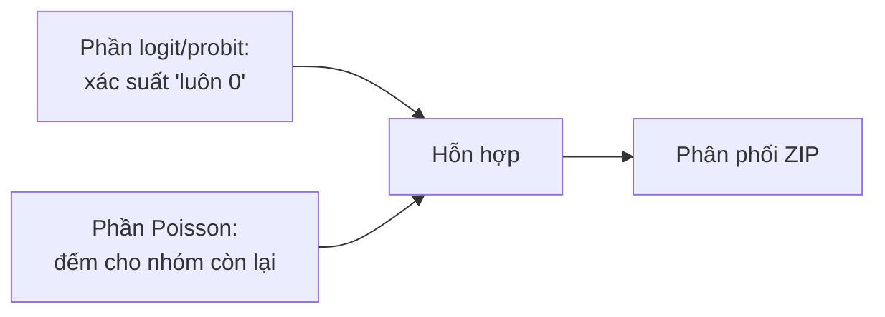

# ZIP — Zero-Inflated Poisson

**ZIP (Zero-Inflated Poisson)** xử lý biến đếm có **dư thừa số 0 (excess zeros)** vượt mức Poisson dự đoán, khi các số 0 đến từ **hai cơ chế** khác nhau: nhóm "luôn 0" (structural zeros) và nhóm đếm Poisson (có thể tình cờ bằng 0).

:::tip Khi nào dùng
Dùng ZIP khi dữ liệu đếm có **rất nhiều số 0** và bạn tin có một nhóm "không bao giờ xảy ra sự kiện" (vd số điếu thuốc/ngày: người không hút luôn = 0).
:::

---

## Cấu trúc hỗn hợp 2 phần

$$
P(Y_i = 0) = \pi_i + (1 - \pi_i) e^{-\mu_i}, \qquad P(Y_i = y) = (1 - \pi_i) \frac{e^{-\mu_i}\mu_i^{y}}{y!}, \; y \ge 1
$$

với $\pi_i$ (xác suất structural zero) mô hình hóa bằng logit/probit; $\mu_i = \exp(X_i\beta)$.

---

## Thực hiện trong EcoLab

1. Module **Mô hình hóa** → họ *Dữ liệu đếm* → **ZIP**.
2. Khai báo biến cho **phần đếm** ($X$) và **phần inflation** (biến dự báo "luôn 0").
3. Chạy; so sánh **Vuong test** với Poisson; xuất **mã tái lập**.

---

## Hạn chế

- Nếu phần đếm vẫn **overdispersion** ⇒ [ZINB](/ecolab/mo-hinh/zinb).
- Diễn giải phức tạp hơn (hai phương trình); cần lý thuyết rõ cho cơ chế zero.

## Xem thêm

- [Poisson](/ecolab/mo-hinh/poisson) · [ZINB](/ecolab/mo-hinh/zinb) · [Negative Binomial](/ecolab/mo-hinh/negbin) · [Danh mục](/ecolab/mo-hinh/danh-muc)
