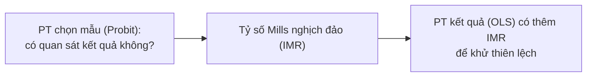

---
title: Heckman — Mô hình chọn mẫu
sidebar_position: 5
description: Mô hình Heckman (Heckit) hiệu chỉnh thiên lệch chọn mẫu (sample selection bias) qua tỷ số Mills nghịch đảo, hai bước/MLE, và cách chạy trong EcoLab.
---

import Tabs from '@theme/Tabs';
import TabItem from '@theme/TabItem';
import VideoTutorial from '@site/src/components/VideoTutorial';

# Heckman — Mô hình hiệu chỉnh chọn mẫu (Heckit)

**Mô hình Heckman (Heckit)** hiệu chỉnh **thiên lệch chọn mẫu (sample selection bias)** — khi việc một quan sát có giá trị kết quả hay không **phụ thuộc các yếu tố** liên quan đến chính kết quả đó. Ví dụ: chỉ quan sát được **tiền lương** của người **có đi làm**; mẫu người đi làm không ngẫu nhiên ⇒ OLS chệch.

:::tip Khi nào dùng
Dùng Heckman khi mẫu kết quả bị **chọn lọc nội sinh** (vd lương ↔ quyết định tham gia lực lượng lao động). Cần một **biến loại trừ (exclusion restriction)**: biến ảnh hưởng việc *được chọn* nhưng không ảnh hưởng trực tiếp *kết quả*.
:::

---

## Cấu trúc 2 phương trình



- **Phương trình chọn mẫu**: $S_i = 1[Z_i \gamma + u_i > 0]$ (Probit).
- **Phương trình kết quả**: $Y_i = X_i \beta + \rho \sigma_\varepsilon \, \lambda(Z_i \gamma) + \xi_i$, với $\lambda(\cdot)$ là **tỷ số Mills nghịch đảo (IMR)**.

Hệ số của IMR có ý nghĩa thống kê ⇒ **có thiên lệch chọn mẫu** (và Heckman là cần thiết).

---

## Hai cách ước lượng

| Cách | Mô tả |
| :--- | :--- |
| **Two-step (Heckit)** | Bước 1 Probit chọn mẫu → tính IMR; bước 2 OLS kết quả có IMR |
| **MLE** | Ước lượng đồng thời cả hai phương trình (hiệu quả hơn) |

---

## Thực hiện trong EcoLab

1. Module **Mô hình hóa** → họ *Biến phụ thuộc giới hạn* → **Heckman**.
2. Khai báo **phương trình kết quả** ($Y$, $X$) và **phương trình chọn mẫu** ($Z$, gồm biến loại trừ).
3. Chọn two-step hoặc MLE; chạy, đọc hệ số IMR ($\rho$) để xác nhận thiên lệch; xuất **mã tái lập**.

---

## Minh họa mã tái lập

<Tabs groupId="lang">
  <TabItem value="stata" label="Stata" default>

```stata
* === Mô hình Heckman — Two-step (Heckit) ===
* PT kết quả: lnwage = f(educ, exper)
* PT chọn mẫu: working = f(married, kids) — biến loại trừ

heckman lnwage educ exper, select(working = married kids) twostep

* Đọc kết quả:
*   - Hệ số PT kết quả (educ, exper)
*   - lambda (IMR): có ý nghĩa ⇒ có thiên lệch chọn mẫu
*   - rho, sigma

* MLE (hiệu quả hơn):
heckman lnwage educ exper, select(working = married kids)
```

  </TabItem>
  <TabItem value="r" label="R">

```r
# === Mô hình Heckman — Two-step (Heckit) ===
library(sampleSelection)

# PT chọn mẫu: working ~ married + kids
# PT kết quả:  lnwage ~ educ + exper
model <- heckit(
  selection = working ~ married + kids,
  outcome   = lnwage ~ educ + exper,
  data      = df,
  method    = "2step"
)
summary(model)

# MLE
model_mle <- heckit(
  selection = working ~ married + kids,
  outcome   = lnwage ~ educ + exper,
  data      = df,
  method    = "ml"
)
summary(model_mle)
```

  </TabItem>
  <TabItem value="python" label="Python">

```python
# === Mô hình Heckman — Two-step thủ công ===
import statsmodels.api as sm
from scipy.stats import norm
import numpy as np

# Bước 1: Probit cho phương trình chọn mẫu
Z = sm.add_constant(df[["married", "kids"]])
probit = sm.Probit(df["working"], Z).fit()

# Tính tỷ số Mills nghịch đảo (IMR / lambda)
Zg = probit.predict(Z)  # xác suất
imr = norm.pdf(norm.ppf(Zg)) / Zg

# Bước 2: OLS phương trình kết quả có thêm IMR
selected = df[df["working"] == 1].copy()
selected["imr"] = imr[df["working"] == 1]
X = sm.add_constant(selected[["educ", "exper", "imr"]])
ols = sm.OLS(selected["lnwage"], X).fit()
print(ols.summary())

# Hệ số imr có ý nghĩa ⇒ có thiên lệch chọn mẫu
```

  </TabItem>
</Tabs>

---

## Hạn chế

- **Rất phụ thuộc biến loại trừ** hợp lệ; thiếu nó, mô hình nhận diện kém (collinearity với IMR).
- Nhạy với giả định chuẩn 2 biến của sai số.

## Video minh họa

<VideoTutorial
  title="Hướng dẫn chạy Heckman (Heckit) trong EcoLab"
  src="https://www.youtube.com/embed/m3wyHeBOfUE"
/>

## Xem thêm

- [Probit](/ecolab/model/probit) · [Tobit](/ecolab/model/tobit) · [Truncated](/ecolab/model/truncated) · [Danh mục](/ecolab/model/group)

