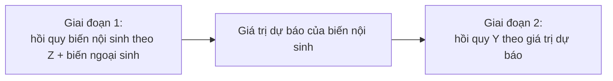

---
title: IV / 2SLS — Biến công cụ
sidebar_position: 1
description: Hồi quy biến công cụ (IV) và bình phương nhỏ nhất hai giai đoạn (2SLS) xử lý nội sinh, điều kiện biến công cụ hợp lệ, kiểm định, và cách chạy trong EcoLab.
---

import Tabs from '@theme/Tabs';
import TabItem from '@theme/TabItem';
import VideoTutorial from '@site/src/components/VideoTutorial';

# IV / 2SLS — Biến công cụ & bình phương nhỏ nhất hai giai đoạn

**IV/2SLS** xử lý **nội sinh (endogeneity)** — khi biến giải thích tương quan với sai số (do biến bị bỏ sót, sai số đo lường, hoặc đồng thời). Khi đó [OLS](/ecolab/model/ols) **chệch và không nhất quán**. IV dùng **biến công cụ (instrument)** để tách phần ngoại sinh của biến nội sinh.

:::warning Điều kiện biến công cụ hợp lệ
Một công cụ $Z$ hợp lệ phải: (1) **liên quan (relevance)** — tương quan với biến nội sinh; (2) **ngoại sinh (exogeneity/exclusion)** — chỉ ảnh hưởng $Y$ **qua** biến nội sinh, không trực tiếp. Công cụ yếu (weak instrument) gây ước lượng chệch nặng.
:::

---

## Cơ chế 2 giai đoạn



$$
\hat{\beta}_{2SLS} = (X' P_Z X)^{-1} X' P_Z Y, \qquad P_Z = Z(Z'Z)^{-1}Z'
$$

---

## Kiểm định bắt buộc

- **Công cụ yếu**: thống kê F giai đoạn 1 (kinh nghiệm: F > 10).
- **Nội sinh**: kiểm định Durbin-Wu-Hausman (có cần IV không?).
- **Overidentification**: kiểm định Sargan/Hansen J (khi số công cụ > số biến nội sinh).

---

## Thực hiện trong EcoLab

1. Module **Mô hình hóa** → họ *IV & hệ phương trình* → **IV/2SLS**.
2. Khai báo $Y$, biến ngoại sinh, **biến nội sinh** và **biến công cụ** $Z$.
3. Chạy, đọc F giai đoạn 1, hệ số 2SLS, Sargan/Hansen; xuất **mã tái lập**.

---

## Minh họa mã tái lập

<Tabs groupId="lang">
  <TabItem value="stata" label="Stata" default>

```stata
* === IV / 2SLS — Ước lượng biến công cụ ===

* Hồi quy 2SLS: educ là biến nội sinh, near_college & parent_educ là công cụ
ivregress 2sls lnwage exper exper2 (educ = near_college parent_educ), first

* Kiểm định công cụ yếu (F giai đoạn 1 > 10)
estat firststage

* Kiểm định overidentification (Sargan/Hansen)
estat overid

* Kiểm định nội sinh (Durbin-Wu-Hausman)
estat endogtest
```

  </TabItem>
  <TabItem value="r" label="R">

```r
# === IV / 2SLS — Ước lượng biến công cụ ===

library(AER)

# Hồi quy 2SLS: educ là nội sinh, near_college & parent_educ là công cụ
# Công thức: Y ~ endogenous + exogenous | instruments + exogenous
iv <- ivreg(lnwage ~ educ + exper + I(exper^2) |
              near_college + parent_educ + exper + I(exper^2),
            data = df)

# Kết quả với kiểm định chẩn đoán (weak instruments, Wu-Hausman, Sargan)
summary(iv, diagnostics = TRUE)
```

  </TabItem>
  <TabItem value="python" label="Python">

```python
# === IV / 2SLS — Ước lượng biến công cụ ===

from linearmodels.iv import IV2SLS

# Chuẩn bị biến
dep = df['lnwage']                            # Biến phụ thuộc
exog = df[['exper', 'exper2']]                # Biến ngoại sinh
endog = df[['educ']]                          # Biến nội sinh
instruments = df[['near_college', 'parent_educ']]  # Biến công cụ

# Ước lượng 2SLS
model = IV2SLS(dep, exog, endog, instruments)
result = model.fit(cov_type='robust')
print(result)

# Kiểm định: first-stage F, Sargan overid, Wu-Hausman đều có trong result
```

  </TabItem>
</Tabs>

---

## Hạn chế

- **Công cụ yếu/không hợp lệ** làm IV tệ hơn OLS.
- Tìm công cụ tốt thường khó; cần lập luận lý thuyết vững.

## Video minh họa

<VideoTutorial
  title="Hướng dẫn chạy IV/2SLS trong EcoLab"
  src="https://www.youtube.com/embed/m3wyHeBOfUE"
/>

## Xem thêm

- [3SLS](/ecolab/model/3sls) · [SUR](/ecolab/model/sur) · [Danh mục](/ecolab/model/group)

