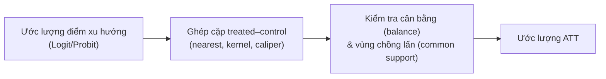

---
title: PSM — Ghép cặp điểm xu hướng
sidebar_position: 2
description: Propensity Score Matching (PSM) đánh giá tác động bằng cách ghép cặp đối tượng xử lý và đối chứng có xác suất tham gia tương tự, và cách chạy trong EcoLab.
---

import Tabs from '@theme/Tabs';
import TabItem from '@theme/TabItem';
import VideoTutorial from '@site/src/components/VideoTutorial';

# PSM — Propensity Score Matching

**PSM (Propensity Score Matching)** đánh giá **tác động của can thiệp** trên dữ liệu quan sát bằng cách **ghép cặp** mỗi đối tượng **xử lý (treated)** với đối tượng **đối chứng (control)** có **điểm xu hướng (propensity score)** — xác suất tham gia ước lượng từ các biến quan sát — tương tự nhau. Mục tiêu: mô phỏng thí nghiệm ngẫu nhiên, giảm thiên lệch chọn lọc theo **biến quan sát được**.

:::warning Giả định then chốt
PSM dựa trên **selection on observables (CIA)**: mọi yếu tố ảnh hưởng cả việc tham gia lẫn kết quả đều **quan sát được**. Nếu có biến gây nhiễu **không quan sát được**, PSM vẫn chệch (khác [IV](/ecolab/model/iv-2sls)/[DiD](/ecolab/model/did) xử lý được phần nào yếu tố không quan sát).
:::

---

## Quy trình



Điểm xu hướng $p(X) = P(\text{treat}=1 \mid X)$ ước lượng bằng [Logit](/ecolab/model/logit)/[Probit](/ecolab/model/probit).

---

## Thực hiện trong EcoLab

1. Module **Mô hình hóa** → họ *Suy luận nhân quả* → **PSM**.
2. Khai báo biến xử lý, biến kết quả, biến nền (covariates); chọn thuật toán ghép cặp.
3. Chạy; kiểm tra **balance** + common support; đọc **ATT**; xuất **mã tái lập**.

---

## Minh họa mã tái lập

<Tabs groupId="lang">
  <TabItem value="stata" label="Stata" default>

```stata
* === PSM — Propensity Score Matching ===

* Ghép cặp: nearest neighbor, caliper = 0.05
* cần cài: ssc install psmatch2
psmatch2 treated x1 x2 x3, outcome(y) neighbor(1) caliper(0.05)

* Kiểm tra cân bằng (balance) sau ghép cặp
pstest x1 x2 x3

* ATT nằm trong kết quả psmatch2
```

  </TabItem>
  <TabItem value="r" label="R">

```r
# === PSM — Propensity Score Matching ===

library(MatchIt)

# Ghép cặp nearest neighbor với caliper
m <- matchit(treated ~ x1 + x2 + x3,
             method  = "nearest",
             caliper = 0.05,
             data    = df)

# Kiểm tra cân bằng
summary(m)
plot(m, type = "jitter")

# Ước lượng ATT trên mẫu đã ghép cặp
matched_df <- match.data(m)
att_model <- lm(y ~ treated, data = matched_df)
summary(att_model)
```

  </TabItem>
  <TabItem value="python" label="Python">

```python
# === PSM — Propensity Score Matching ===

from causalinference import CausalModel
import numpy as np

Y = df['y'].values
D = df['treated'].values
X = df[['x1', 'x2', 'x3']].values

# Mô hình nhân quả
cm = CausalModel(Y, D, X)

# Ước lượng điểm xu hướng + ghép cặp
cm.est_propensity()
cm.est_via_matching(matches=1, bias_adj=True)

print(cm.estimates)

# Hoặc dùng DoWhy:
# import dowhy
# model = dowhy.CausalModel(data=df, treatment='treated',
#             outcome='y', common_causes=['x1','x2','x3'])
# identified = model.identify_effect()
# estimate = model.estimate_effect(identified,
#             method_name='backdoor.propensity_score_matching')
```

  </TabItem>
</Tabs>

---

## Hạn chế

- Không xử lý **nhiễu không quan sát được**.
- Nhạy với lựa chọn thuật toán ghép cặp; cần kiểm tra cân bằng kỹ.

## Video minh họa

<VideoTutorial
  title="Hướng dẫn chạy PSM trong EcoLab"
  src="https://www.youtube.com/embed/m3wyHeBOfUE"
/>

## Xem thêm

- [DiD](/ecolab/model/did) · [RDD](/ecolab/model/rdd) · [Danh mục](/ecolab/model/group)

