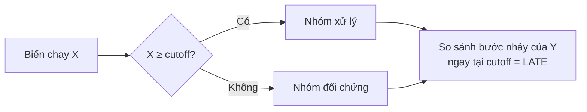

import Tabs from '@theme/Tabs';
import TabItem from '@theme/TabItem';
import VideoTutorial from '@site/src/components/VideoTutorial';

# RDD — Regression Discontinuity Design

**RDD (Hồi quy gián đoạn)** đánh giá tác động nhân quả khi việc nhận can thiệp được quyết định bởi một **ngưỡng (cutoff)** của một **biến chạy (running variable)** — vd điểm thi ≥ ngưỡng thì được học bổng. So sánh đối tượng **ngay trên và ngay dưới ngưỡng** (gần như ngẫu nhiên) cho ước lượng nhân quả đáng tin tại ngưỡng.

:::tip Sharp vs Fuzzy
**Sharp RDD**: vượt ngưỡng ⇒ chắc chắn nhận can thiệp. **Fuzzy RDD**: vượt ngưỡng chỉ **tăng xác suất** nhận ⇒ kết hợp với [IV](/ecolab/model/iv-2sls) (dùng ngưỡng làm công cụ).
:::

---

## Trực giác



Ước lượng **bước nhảy (jump)** của $E[Y \mid X]$ tại ngưỡng $c$; đây là tác động nhân quả cục bộ (LATE) tại ngưỡng.

---

## Thực hiện trong EcoLab

1. Module **Mô hình hóa** → họ *Suy luận nhân quả* → **RDD**.
2. Khai báo **biến chạy**, **ngưỡng**, biến kết quả; chọn sharp/fuzzy, băng thông (bandwidth), bậc đa thức.
3. Chạy; xem đồ thị RDD + ước lượng tại ngưỡng; kiểm định **McCrary** (thao túng ngưỡng); xuất **mã tái lập**.

---

## Minh họa mã tái lập

<Tabs groupId="lang">
  <TabItem value="stata" label="Stata" default>

```stata
* === RDD — Regression Discontinuity Design ===
* cần cài: ssc install rdrobust

* Ước lượng RDD với băng thông tối ưu
rdrobust y score, c(50)

* Đồ thị RDD (scatter + đường khớp hai bên ngưỡng)
rdplot y score, c(50)
```

  </TabItem>
  <TabItem value="r" label="R">

```r
# === RDD — Regression Discontinuity Design ===

library(rdrobust)

# Ước lượng RDD với băng thông tối ưu
rd <- rdrobust(y = df$y, x = df$score, c = 50)
summary(rd)

# Đồ thị RDD
rdplot(y = df$y, x = df$score, c = 50)
```

  </TabItem>
  <TabItem value="python" label="Python">

```python
# === RDD — Regression Discontinuity Design ===

from rdrobust import rdrobust, rdplot

# Ước lượng RDD với băng thông tối ưu
result = rdrobust(y=df['y'], x=df['score'], c=50)
print(result)

# Đồ thị RDD
rdplot(y=df['y'], x=df['score'], c=50)
```

  </TabItem>
</Tabs>

---

## Hạn chế

- Chỉ nhận dạng tác động **cục bộ tại ngưỡng** (LATE), không khái quát toàn mẫu.
- Nhạy với **băng thông** và dạng hàm; cần kiểm tra thao túng biến chạy.

## Video minh họa

<VideoTutorial
  title="Hướng dẫn chạy RDD trong EcoLab"
  src="https://www.youtube.com/user/vietlod"
/>

## Xem thêm

- [DiD](/ecolab/model/did) · [PSM](/ecolab/model/psm) · [IV/2SLS](/ecolab/model/iv-2sls) · [Danh mục](/ecolab/model/group)
