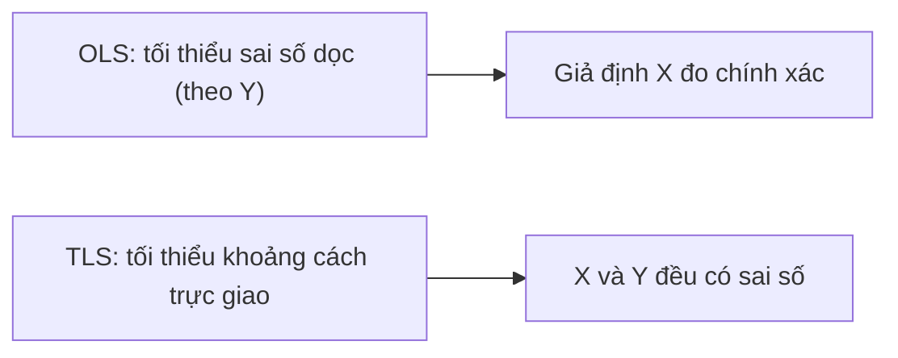

import Tabs from '@theme/Tabs';
import TabItem from '@theme/TabItem';
import VideoTutorial from '@site/src/components/VideoTutorial';

# TLS — Bình phương nhỏ nhất toàn phần

**TLS (Total Least Squares)** — còn gọi là hồi quy trực giao — xử lý trường hợp **cả biến độc lập $X$ lẫn biến phụ thuộc $Y$ đều có sai số đo lường** (errors-in-variables). Trong khi [OLS](/ecolab/model/ols) chỉ tối thiểu hóa sai số theo phương $Y$, TLS tối thiểu hóa **khoảng cách trực giao** từ điểm dữ liệu đến đường hồi quy.

:::tip Khi nào dùng
Dùng TLS khi $X$ **không đo lường chính xác** (sai số đo). OLS khi đó cho hệ số **chệch về 0 (attenuation bias)**; TLS giảm thiểu vấn đề này.
:::

---

## Trực giác



OLS tối thiểu $\sum (Y_i - \hat{Y}_i)^2$ (theo trục $Y$); TLS tối thiểu tổng **bình phương khoảng cách vuông góc** từ điểm $(X_i, Y_i)$ tới đường hồi quy.

---

## Đặc tả mô hình

Với mô hình errors-in-variables: $Y_i = \beta_0 + \beta_1 X_i^{*} + \varepsilon_i$ nhưng ta chỉ quan sát $X_i = X_i^{*} + u_i$ (có nhiễu $u_i$). TLS ước lượng $\beta$ qua phân rã giá trị suy biến (SVD) của ma trận dữ liệu mở rộng $[X \mid Y]$.

---

## Thực hiện trong EcoLab

1. Module **Mô hình hóa** → họ *Hồi quy tuyến tính cổ điển* → **TLS**.
2. Chọn $Y$ và các $X$ nghi có sai số đo lường.
3. Chạy và **so sánh hệ số với OLS** để thấy mức hiệu chỉnh attenuation; xuất **mã tái lập**.

---

## Minh họa mã tái lập

<Tabs groupId="lang">
  <TabItem value="stata" label="Stata" default>

```stata
* === Errors-in-variables regression (Stata) ===
* eivreg: hồi quy sai số đo lường
* r(x1 0.9) nghĩa là reliability ratio của x1 = 0.9
eivreg y x1 x2, r(x1 0.9)

* So sánh với OLS thường
regress y x1 x2
```

  </TabItem>
  <TabItem value="r" label="R">

```r
# === TLS / Deming regression trong R ===
library(deming)

# Deming regression (trường hợp đặc biệt TLS khi tỉ lệ phương sai = 1)
model_tls <- deming(y ~ x1, data = df)
print(model_tls)

# So sánh với OLS
model_ols <- lm(y ~ x1, data = df)
cbind(TLS = coef(model_tls), OLS = coef(model_ols))
```

  </TabItem>
  <TabItem value="python" label="Python">

```python
import numpy as np
from scipy.odr import ODR, Model, RealData

# === TLS / Orthogonal Distance Regression ===
# Định nghĩa mô hình tuyến tính: y = beta[0] + beta[1]*x
def linear_func(B, x):
    return B[0] + B[1] * x

linear_model = Model(linear_func)
data = RealData(df['x1'], df['y'])

# Ước lượng sơ bộ từ OLS
odr = ODR(data, linear_model, beta0=[0, 1])
output = odr.run()
output.pprint()  # In hệ số TLS và sai số chuẩn
```

  </TabItem>
</Tabs>

---

## Hạn chế

- Cần giả định về **tỉ lệ phương sai sai số** giữa $X$ và $Y$.
- Nếu có biến công cụ tốt, [IV/2SLS](/ecolab/model/group) là lựa chọn thay thế phổ biến cho errors-in-variables.

## Video minh họa

<VideoTutorial
  title="Hướng dẫn chạy TLS trong EcoLab"
  src="https://www.youtube.com/user/vietlod"
/>

## Xem thêm

- [OLS](/ecolab/model/ols) · [GLS](/ecolab/model/gls) · [Danh mục mô hình](/ecolab/model/group)
