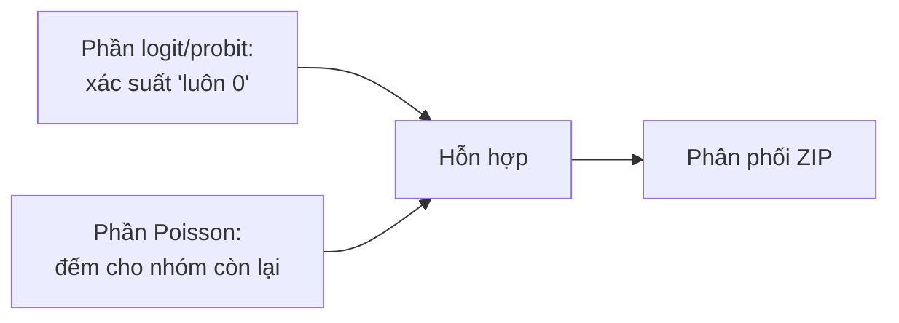

import Tabs from '@theme/Tabs';
import TabItem from '@theme/TabItem';
import VideoTutorial from '@site/src/components/VideoTutorial';

# ZIP — Zero-Inflated Poisson

**ZIP (Zero-Inflated Poisson)** xử lý biến đếm có **dư thừa số 0 (excess zeros)** vượt mức Poisson dự đoán, khi các số 0 đến từ **hai cơ chế** khác nhau: nhóm "luôn 0" (structural zeros) và nhóm đếm Poisson (có thể tình cờ bằng 0).

:::tip Khi nào dùng
Dùng ZIP khi dữ liệu đếm có **rất nhiều số 0** và bạn tin có một nhóm "không bao giờ xảy ra sự kiện" (vd số điếu thuốc/ngày: người không hút luôn = 0).
:::

---

## Cấu trúc hỗn hợp 2 phần



$$
P(Y_i = 0) = \pi_i + (1 - \pi_i) e^{-\mu_i}, \qquad P(Y_i = y) = (1 - \pi_i) \frac{e^{-\mu_i}\mu_i^{y}}{y!}, \; y \ge 1
$$

với $\pi_i$ (xác suất structural zero) mô hình hóa bằng logit/probit; $\mu_i = \exp(X_i\beta)$.

---

## Thực hiện trong EcoLab

1. Module **Mô hình hóa** → họ *Dữ liệu đếm* → **ZIP**.
2. Khai báo biến cho **phần đếm** ($X$) và **phần inflation** (biến dự báo "luôn 0").
3. Chạy; so sánh **Vuong test** với Poisson; xuất **mã tái lập**.

---

## Minh họa mã tái lập

<Tabs groupId="lang">
  <TabItem value="stata" label="Stata" default>

```stata
* === Zero-Inflated Poisson (ZIP) ===
zip patents rd_spend firm_size, inflate(small_firm) vuong

* inflate(): biến dự báo nhóm "luôn 0"
* vuong: kiểm định Vuong so sánh ZIP vs Poisson chuẩn

* Đọc kết quả:
*   - Phần đếm (Poisson): hệ số rd_spend, firm_size
*   - Phần inflation (Logit): hệ số small_firm
*   - Vuong test: z > 1.96 ⇒ ZIP phù hợp hơn Poisson
```

  </TabItem>
  <TabItem value="r" label="R">

```r
# === Zero-Inflated Poisson (ZIP) ===
library(pscl)

model <- zeroinfl(
  patents ~ rd_spend + firm_size | small_firm,
  data = df,
  dist = "poisson"
)
summary(model)

# So sánh AIC với Poisson chuẩn
pois <- glm(patents ~ rd_spend + firm_size, family = poisson, data = df)
AIC(pois, model)

# Vuong test (tích hợp trong summary của zeroinfl)
```

  </TabItem>
  <TabItem value="python" label="Python">

```python
# === Zero-Inflated Poisson (ZIP) ===
import statsmodels.api as sm

X = sm.add_constant(df[["rd_spend", "firm_size"]])
Z = sm.add_constant(df[["small_firm"]])  # biến inflation
y = df["patents"]

model = sm.ZeroInflatedPoisson(
    endog      = y,
    exog       = X,
    exog_infl  = Z,
    inflation  = "logit"
).fit()

print(model.summary())

# So sánh AIC với Poisson chuẩn
pois = sm.GLM(y, X, family=sm.families.Poisson()).fit()
print(f"\nAIC Poisson: {pois.aic:.2f}")
print(f"AIC ZIP:     {model.aic:.2f}")
```

  </TabItem>
</Tabs>

---

## Hạn chế

- Nếu phần đếm vẫn **overdispersion** ⇒ [ZINB](/ecolab/model/zinb).
- Diễn giải phức tạp hơn (hai phương trình); cần lý thuyết rõ cho cơ chế zero.

## Video minh họa

<VideoTutorial
  title="Hướng dẫn chạy Zero-Inflated Poisson (ZIP) trong EcoLab"
  src="https://www.youtube.com/user/vietlod"
/>

## Xem thêm

- [Poisson](/ecolab/model/poisson) · [ZINB](/ecolab/model/zinb) · [Negative Binomial](/ecolab/model/negbin) · [Danh mục](/ecolab/model/group)
