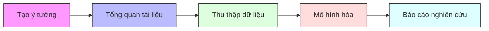

# Tổng quan EcoLab

**EcoLab** (phiên bản v0.22.0) là nền tảng nghiên cứu kinh tế lượng được hỗ trợ bởi trí tuệ nhân tạo (AI-powered Econometrics Research Platform). Hệ thống được thiết kế nhằm tự động hóa và tối ưu hóa toàn bộ quy trình nghiên cứu học thuật — từ bước phát triển ý tưởng ban đầu cho đến khi xuất bản báo cáo hoàn thiện.

Nền tảng tích hợp các tác tử AI (AI Agents) chuyên biệt cùng hơn 30 mô hình kinh tế lượng để hỗ trợ các nhà nghiên cứu vượt qua các rào cản về kỹ thuật và dữ liệu.

---

## 1. Kiến trúc Công nghệ

Hệ thống EcoLab được xây dựng dựa trên sự kết hợp của các công nghệ hiện đại và chuyên nghiệp:

| Thành phần | Công nghệ tích hợp | Mục đích sử dụng |
| :--- | :--- | :--- |
| **Frontend** | Next.js 14, React 18, TypeScript, Tailwind CSS | Giao diện tối giản sang trọng, tương tác mượt mà và tối ưu hóa trải nghiệm người dùng (UX). |
| **Backend** | FastAPI, Python 3.11 | Cung cấp REST API hiệu năng cao, WebSocket thời gian thực và điều phối tác tử AI. |
| **Trí tuệ nhân tạo** | DeepSeek, OpenAI, Gemini, Perplexity, OpenRouter | Đa nhà cung cấp mô hình ngôn ngữ lớn (LLM) với cơ chế tự động chuyển đổi dự phòng (failover) và ngắt mạch (circuit breaker). |
| **Cơ sở dữ liệu** | PostgreSQL 14, Redis 7, Neo4j 5 | Quản lý dữ liệu người dùng, bộ nhớ đệm và lưu trữ Đồ thị tri thức (Knowledge Graph) phức tạp. |

---

## 2. Đối tượng phục vụ

EcoLab hướng tới việc nâng cao năng suất và chất lượng nghiên cứu của cộng đồng học thuật chuyên nghiệp:

*   **Học viên Cao học & Nghiên cứu sinh:** Hỗ trợ thực hiện luận văn, luận án thạc sĩ/tiến sĩ trong ngành kinh tế, tài chính và các ngành khoa học xã hội liên quan một cách bài bản và chuẩn khoa học.
*   **Giảng viên Đại học:** Hỗ trợ chuẩn bị tài liệu giảng dạy, định hướng nghiên cứu cho sinh viên và thực hiện các công trình nghiên cứu cá nhân/đề tài các cấp.
*   **Nhà nghiên cứu & Chuyên gia phân tích:** Hỗ trợ các viện nghiên cứu, chuyên gia tư vấn thực hiện đánh giá chính sách và phân tích định lượng thực nghiệm với độ tin cậy cao.

---

## 3. Quy trình nghiên cứu 5 bước (5-Step Research Pipeline)

Để đảm bảo tính nhất quán khoa học, EcoLab tổ chức nghiên cứu theo một quy trình khép kín gồm 5 bước. Ngữ cảnh của bước trước sẽ tự động được truyền và kế thừa ở bước tiếp theo:

1.  **Tạo ý tưởng (Idea Generation):** Phát triển và đánh giá các ý tưởng nghiên cứu sơ bộ từ từ khóa hoặc nhân bản ý tưởng từ các bài báo học thuật hiện có.
2.  **Tổng quan tài liệu (Literature Review):** Tự động tìm kiếm bài báo liên quan, phân tích lỗ hổng nghiên cứu, xác định mục tiêu và đề xuất mô hình kiểm định.
3.  **Thu thập dữ liệu (Data Collection):** Nhập dữ liệu tự động từ các nguồn công khai uy tín (World Bank, FRED, ADB, IMF) hoặc tải lên tệp tin cục bộ.
4.  **Mô hình hóa (Modeling):** Thực hiện hồi quy với hơn 30 mô hình kinh tế lượng trên các môi trường ước lượng Python, R hoặc Stata.
5.  **Báo cáo nghiên cứu (Research Report):** Tự động tạo bản thảo học thuật chuẩn format (APA7, Chicago, Harvard, v.v.) qua pipeline STORM chuyên sâu.
