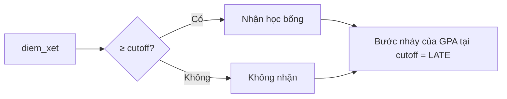

# Ví dụ: Tác động của học bổng lên kết quả học tập (RDD)

Minh họa [RDD](/ecolab/mo-hinh/rdd): học bổng được cấp cho sinh viên có **điểm xét ≥ ngưỡng**. So sánh sinh viên **ngay trên và ngay dưới ngưỡng** (gần như ngẫu nhiên) cho ước lượng nhân quả đáng tin tại ngưỡng. Số liệu là **minh họa**.

> Tóm tắt: ước lượng **bước nhảy** của kết quả học tập (GPA năm sau) tại ngưỡng điểm xét = tác động nhân quả của học bổng tại ngưỡng.

---

## Bước 1 — Ý tưởng
- **Câu hỏi:** nhận học bổng có cải thiện kết quả học tập không?

## Bước 2 — Tổng quan tài liệu
Đánh giá tác động hỗ trợ tài chính giáo dục; thiết kế gián đoạn hồi quy.

## Bước 3 — Thu thập dữ liệu

| Vai trò | Biến | Mô tả |
| :--- | :--- | :--- |
| Biến chạy | `diem_xet` | điểm xét tuyển (running variable) |
| Ngưỡng | `cutoff` | điểm chuẩn cấp học bổng |
| Can thiệp | `hoc_bong` | 1 nếu nhận (sharp: điểm ≥ cutoff) |
| Kết quả | `gpa_sau` | GPA kỳ/năm sau |

## Bước 4 — Mô hình hóa

Chọn họ *Suy luận nhân quả* → **RDD** (sharp); khai báo biến chạy, ngưỡng, băng thông:

**Kết quả minh họa (định dạng — không phải kết quả thực):**

| | Giá trị |
| :--- | :--- |
| Bước nhảy GPA tại ngưỡng (LATE) | +0.18*** |
| Băng thông tối ưu | ±0.5 điểm |
| McCrary (p) | 0.42 (không thao túng ngưỡng) |

Diễn giải mẫu: học bổng làm **tăng GPA ~0.18** tại ngưỡng; kiểm định McCrary không bác bỏ ⇒ không có dấu hiệu thao túng điểm quanh ngưỡng. Tác động này là **cục bộ tại ngưỡng** (LATE).

## Bước 5 — Báo cáo
Xuất báo cáo + **đồ thị RDD** (scatter + đường khớp 2 bên ngưỡng) + **mã tái lập**.

## Xem thêm
- [RDD](/ecolab/mo-hinh/rdd) · [PSM](/ecolab/mo-hinh/psm) · [DiD](/ecolab/mo-hinh/did) · [Danh mục](/ecolab/mo-hinh/danh-muc)
