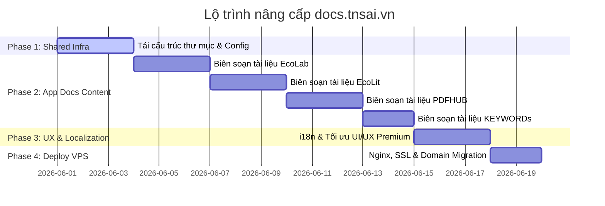

# Kế hoạch cải tiến trang tài liệu hướng dẫn dùng chung (docs.tnsai.vn)

Tài liệu này mô tả chi tiết lộ trình cải tiến trang hướng dẫn EcoData hiện tại thành cổng tài liệu hướng dẫn dùng chung cho 5 ứng dụng: **EcoData, EcoLab, EcoLit, PDFHUB, và KEYWORDs** với tên miền mới là `https://docs.tnsai.vn/`.

Kế hoạch được chia nhỏ theo nguyên tắc: **Phase (Giai đoạn) → Session (Phiên làm việc) → Task (Nhiệm vụ) → Checkpoint (Điểm kiểm soát)** để dễ dàng theo dõi và triển khai.

---

## PHẦN 1: TỔNG QUAN LỘ TRÌNH (PHASES)



---

## PHẦN 2: CHI TIẾT CÁC GIAI ĐOẠN TRIỂN KHAI

### PHASE 1: CHUẨN BỊ VÀ KIẾN TRÚC DÙNG CHUNG (SHARED INFRASTRUCTURE)
**Mục tiêu**: Thiết lập cấu trúc thư mục và cấu hình Docusaurus hỗ trợ nhiều ứng dụng song song với hệ thống đa ngôn ngữ.

#### Session 1.1: Tái cấu trúc thư mục tài liệu
- **Task 1.1.1**: Tạo cấu trúc thư mục con cho từng ứng dụng trong thư mục `docs/`.
  - Tạo `docs/ecodata/`, `docs/ecolab/`, `docs/ecolit/`, `docs/pdfhub/`, `docs/keywords/`.
- **Task 1.1.2**: Di chuyển toàn bộ file tài liệu hiện tại của EcoData từ thư mục gốc `docs/` vào thư mục `docs/ecodata/`.
- **Task 1.1.3**: Tương tự, tái cấu trúc thư mục dịch tiếng Anh `i18n/en/docusaurus-plugin-content-docs/current/` để di chuyển các bản dịch EcoData vào thư mục `ecodata/` tương ứng.
- **Checkpoint 1.1**: Thư mục `docs/` và thư mục dịch `i18n/en/...` được tổ chức ngăn nắp theo cấu trúc 5 thư mục con của 5 ứng dụng. Không còn các file markdown của EcoData nằm ở thư mục gốc (ngoại trừ file overview chung nếu cần).

#### Session 1.2: Cập nhật Cấu hình & Sidebar Docusaurus
- **Task 1.2.1**: Chỉnh sửa file [sidebars.js](file:///d:/docs/sidebars.js):
  - Chuyển `guideSidebar` hiện tại thành `ecodataSidebar`, cập nhật tiền tố đường dẫn `ecodata/` cho tất cả các item.
  - Định nghĩa 4 sidebar mới: `ecolabSidebar`, `ecolitSidebar`, `pdfhubSidebar`, `keywordsSidebar` với cấu trúc ban đầu.
- **Task 1.2.2**: Chỉnh sửa file [docusaurus.config.js](file:///d:/docs/docusaurus.config.js):
  - Thay đổi `url` thành `https://docs.tnsai.vn`.
  - Cập nhật navbar để tạo các tab chuyển đổi: EcoData, EcoLab, EcoLit, PDFHUB, KEYWORDs ở vị trí bên trái sử dụng kiểu `docSidebar`.
  - Thay đổi logo dự án thành logo TNS AI dùng chung.
- **Checkpoint 1.2**: Chạy thử lệnh `npm run start` và kiểm tra thanh navbar phía trên hiển thị đủ 5 tab chuyển đổi ứng dụng. Click vào từng tab chuyển đổi đúng sidebar của ứng dụng đó.

---

### PHASE 2: BIÊN SOẠN NỘI DUNG TÀI LIỆU HƯỚNG DẪN CÁC APP (APP CONTENT INTEGRATION)
**Mục tiêu**: Xây dựng nội dung tài liệu hướng dẫn chi tiết cho từng app dựa trên việc nghiên cứu mã nguồn và tài liệu hiện có trong codebase của họ.

#### Session 2.1: Biên soạn tài liệu cho EcoLab
- **Task 2.1.1**: Nghiên cứu codebase `D:\FLOW\EconLab` (các file `docs/HDSD.md`, `docs/rag.md`, `docs/econometrics-in-python.md`, `docs/membership.md`).
- **Task 2.1.2**: Biên soạn các trang hướng dẫn sử dụng tiếng Việt trong `docs/ecolab/`:
  - `overview.md`: Giới thiệu tổng quan về EcoLab và các phân hệ.
  - `bat-dau/login-navigation.md`: Hướng dẫn đăng ký, đăng nhập và giao diện.
  - `rag-knowledge-graph.md`: Hướng dẫn sử dụng tính năng RAG kết hợp Đồ thị tri thức (Neo4j) để tra cứu tài liệu kinh tế.
  - `econometrics-modeling.md`: Hướng dẫn sử dụng Econometrics Bridge kết nối ECODATA để chạy 105 mô hình ước lượng định lượng.
  - `membership-billing.md`: Hướng dẫn nâng cấp tài khoản và cơ chế thanh toán qua SePay.
- **Task 2.1.3**: Dịch toàn bộ tài liệu EcoLab sang tiếng Anh tại `i18n/en/docusaurus-plugin-content-docs/current/ecolab/`.
- **Checkpoint 2.1**: Có đầy đủ tài liệu hướng dẫn EcoLab bằng cả tiếng Việt và tiếng Anh, bao quát được các tính năng cốt lõi: RAG, Econometrics, Membership.

#### Session 2.2: Biên soạn tài liệu cho EcoLit
- **Task 2.2.1**: Nghiên cứu codebase `D:\EconLit` (các file `docs/PRD.md`, `docs/OpenAlex_PRD.md`, `docs/Crossref_PRD.md`).
- **Task 2.2.2**: Soạn thảo các trang hướng dẫn tiếng Việt trong `docs/ecolit/`:
  - `overview.md`: Giới thiệu EcoLit - Công cụ hỗ trợ thu thập và phân tích tài liệu học thuật.
  - `openalex-search.md`: Hướng dẫn tìm kiếm tác giả, bài viết, trích xuất dữ liệu qua OpenAlex API.
  - `crossref-metadata.md`: Hướng dẫn tra cứu siêu dữ liệu (metadata) và DOI qua CrossRef.
  - `orcid-integration.md`: Hướng dẫn đồng bộ và quản lý hồ sơ nghiên cứu cá nhân qua ORCID.
- **Task 2.2.3**: Dịch tài liệu EcoLit sang tiếng Anh tại `i18n/en/docusaurus-plugin-content-docs/current/ecolit/`.
- **Checkpoint 2.2**: Tài liệu EcoLit được tích hợp thành công, giải thích rõ cách khai thác dữ liệu từ OpenAlex, Crossref và tích hợp ORCID.

#### Session 2.3: Biên soạn tài liệu cho PDFHUB
- **Task 2.3.1**: Nghiên cứu codebase `D:\PDFHUB` (các file `docs/ui_ux_specification.md`, `docs/agentic-rag-financial-parser.md`, `docs/liteparse-1.md`).
- **Task 2.3.2**: Soạn thảo các trang hướng dẫn tiếng Việt trong `docs/pdfhub/`:
  - `overview.md`: Giới thiệu PDFHUB - Công cụ phân tích báo cáo tài chính tự động.
  - `parser-engine.md`: Hướng dẫn tải lên tài liệu PDF, cấu hình parse dữ liệu tài chính.
  - `liteparse-prompt-caching.md`: Giải thích cơ chế LiteParse và cách sử dụng Prompt Caching để tiết kiệm chi phí API.
  - `agentic-rag-finance.md`: Cách sử dụng Agentic RAG để truy vấn thông tin sâu từ báo cáo tài chính doanh nghiệp.
- **Task 2.3.3**: Dịch tài liệu PDFHUB sang tiếng Anh tại `i18n/en/docusaurus-plugin-content-docs/current/pdfhub/`.
- **Checkpoint 2.3**: Hoàn thành biên soạn tài liệu PDFHUB, mô tả chi tiết quy trình xử lý PDF tài chính và cơ chế Prompt Caching/Agentic RAG.

#### Session 2.4: Biên soạn tài liệu cho KEYWORDs
- **Task 2.4.1**: Nghiên cứu codebase `D:\tools\fintech` (các file `README.md`, `CHANGELOG.md`).
- **Task 2.4.2**: Soạn thảo các trang hướng dẫn tiếng Việt trong `docs/keywords/`:
  - `overview.md`: Giới thiệu KEYWORDs - Hệ thống cào và phân tích từ khóa tài chính SEO.
  - `crawler-settings.md`: Hướng dẫn thiết lập nguồn cào từ khóa và tần suất.
  - `semantic-analysis.md`: Hướng dẫn phân tích ngữ nghĩa, phân nhóm từ khóa và đánh giá hiệu quả SEO.
- **Task 2.4.3**: Dịch tài liệu KEYWORDs sang tiếng Anh tại `i18n/en/docusaurus-plugin-content-docs/current/keywords/`.
- **Checkpoint 2.4**: Tài liệu KEYWORDs được tích hợp đầy đủ, hướng dẫn chi tiết cách chạy cào dữ liệu từ khóa và xem báo cáo SEO.

---

### PHASE 3: TỐI ƯU HÓA UI/UX, ĐA NGÔN NGỮ & KIỂM THỬ (UX & LOCALIZATION)
**Mục tiêu**: Hoàn thiện trải nghiệm người dùng, đảm bảo tính thẩm mỹ premium và loại bỏ hoàn toàn việc hardcode ngôn ngữ.

#### Session 3.1: Quản lý Đa ngôn ngữ (i18n) & Tránh Hardcode
- **Task 3.1.1**: Rà soát toàn bộ các file mã nguồn React trong `src/` và cấu hình Docusaurus.
- **Task 3.1.2**: Trích xuất toàn bộ text giao diện cứng vào các file dịch `i18n/en/code.json` (bản tiếng Anh) và tạo file dịch tiếng Việt tương ứng nếu cần.
- **Task 3.1.3**: Đảm bảo nút chuyển đổi ngôn ngữ hoạt động đồng bộ trên tất cả các trang, khi đổi locale thì cả sidebar, navbar và nội dung markdown đều được dịch tương ứng.
- **Checkpoint 3.1**: Không còn bất kỳ đoạn text nào bị hardcode trực tiếp trên giao diện. Đổi ngôn ngữ dịch chính xác 100% nội dung navbar và sidebar.

#### Session 3.2: Thiết kế UI/UX Premium & Responsive
- **Task 3.2.1**: Thiết kế giao diện premium, sang trọng, mang phong cách học thuật chuyên nghiệp:
  - Cập nhật bảng màu CSS tùy chỉnh tại `src/css/custom.css` (sử dụng HSL tailored colors, màu tối/sáng hài hòa, tăng cường độ tương phản, bo góc mềm mại).
  - Tích hợp font chữ học thuật hiện đại (ví dụ: Inter, Playfair Display hoặc Outfit từ Google Fonts).
  - Thêm hiệu ứng hover mượt mà cho các phần tử menu, liên kết.
- **Task 3.2.2**: Tối ưu hóa hiển thị responsive:
  - Đảm bảo các bảng biểu (tables) lớn tự động hỗ trợ cuộn ngang trên mobile.
  - Tối ưu hóa hiển thị mã nguồn (code blocks) và sơ đồ Mermaid trên màn hình nhỏ.
- **Checkpoint 3.2**: Chạy kiểm thử trên thiết bị di động (giả lập Chrome DevTools) đạt hiển thị responsive hoàn hảo, không bị tràn màn hình, giao diện bắt mắt và chuyên nghiệp.

---

### PHASE 4: TRIỂN KHAI VPS VÀ CẤU HÌNH DOMAIN MỚI (VPS DEPLOYMENT)
**Mục tiêu**: Deploy phiên bản mới lên VPS và chuyển cấu hình domain từ `ecodata.tnsai.vn` sang `docs.tnsai.vn`.

#### Session 4.1: Cấu hình VPS & Nginx
- **Task 4.1.1**: Đăng nhập VPS qua SSH (sử dụng thông tin Remote được cấp trong yêu cầu).
- **Task 4.1.2**: Tạo file cấu hình Nginx mới tại `/etc/nginx/sites-available/docs.tnsai.vn`.
- **Task 4.1.3**: Cấu hình trỏ thư mục gốc của trang docs.tnsai.vn về `/opt/docs/build` (hoặc đường dẫn build tương ứng trên VPS).
- **Checkpoint 4.1**: Cấu hình Nginx được verify không có lỗi (`nginx -t`) và được reload thành công.

#### Session 4.2: Thiết lập SSL & Deploy
- **Task 4.2.1**: Chạy Certbot trên VPS để cấp chứng chỉ SSL Let's Encrypt cho domain `docs.tnsai.vn`:
  ```bash
  certbot --nginx -d docs.tnsai.vn
  ```
- **Task 4.2.2**: Biên dịch production bundle tại local bằng `npm run build` và deploy lên VPS tại đường dẫn cấu hình.
- **Task 4.2.3**: Thực hiện kiểm tra E2E thực tế trên môi trường live:
  - Truy cập `https://docs.tnsai.vn/` đảm bảo HTTPS hoạt động.
  - Truy cập `https://ecodata.tnsai.vn/` cũ và kiểm tra xem có redirect mượt mà sang domain mới hay không.
- **Checkpoint 4.2**: Trang tài liệu `docs.tnsai.vn` hoạt động ổn định trên VPS với chứng chỉ SSL hợp lệ. Cơ chế redirect 301 hoạt động chính xác.
