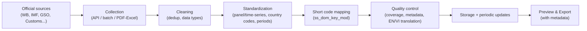

import Head from '@docusaurus/Head';

export const methodSchema = {
  '@context': 'https://schema.org',
  '@type': 'TechArticle',
  '@id': 'https://docs.tnsai.vn/en/ecodata/du-lieu/methodology#article',
  headline: 'EcoData data methodology',
  description:
    'How EcoData collects, cleans, standardizes, quality-controls and updates economic and financial data, including limitations and reproducibility principles.',
  url: 'https://docs.tnsai.vn/en/ecodata/du-lieu/methodology',
  inLanguage: ['vi', 'en'],
  author: { '@type': 'Organization', name: 'EcoData', url: 'https://ecodata.io.vn/' },
  publisher: { '@type': 'Organization', name: 'EcoData', url: 'https://ecodata.io.vn/' },
  about: ['data aggregation', 'data cleaning', 'standardization', 'metadata', 'reproducibility'],
};

<Head>
  
</Head>

# Data Methodology

EcoData does not produce primary data. The platform's role is to **aggregate, clean, and standardize** data from official sources into a single, consistent, metadata-rich format ready for analysis and publication. This page transparently describes that process so users can assess the reliability and limitations of the data.

## Overall process

## 1. Data collection

EcoData uses several collection mechanisms depending on the source:

- **Direct APIs**: SDMX standard for IMF, Eurostat, OECD, ILO; REST for World Bank, FAO, OWID; key-based access for FRED, WTO, UNCTAD, ADB.
- **Batch loading**: CSV/XLSX files for some large indicator sets (e.g. ADB, IMF datasets).
- **Yearbooks & PDF/Excel reports**: GSO data (KTXH, NGTK-CN, NGTK-TINH) and Customs reports are extracted under controlled procedures.
- **Surveys & microdata**: PCI, PAPI, PAR, SIPAS, ICT by province-year; VHLSS/VARHS/VES microdata loaded by wave.
- **Stocks**: prices, financial statements, notes, and corporate event calendars for listed companies.

## 2. Data cleaning

- **Deduplicate** records and standardize data types (numeric, date, string).
- **Identifier standardization**: country codes, province codes, commodity codes; attach standard period keys (`Q1`–`Q4`, `M01`–`M12`).
- **Drop empty/out-of-scope indicators**: series without valid `time_start`/`time_end` (or `time_end <= time_start`) are hidden from the public catalogue to reduce noise.

## 3. Standardization

- **Consistent panel / time-series format** by unit of analysis (country, province, firm, household, individual).
- **Short code mapping** `ss_dom_key_mod` to unify indicator names across sources — see [Data Dictionary](/ecodata/du-lieu/data-dictionary).
- **Keep the original unit** in metadata; EcoData does not convert units when the source does not provide a conversion.

## 4. Quality control

- **Mandatory metadata**: every indicator must have a label, unit, frequency, source, and time coverage.
- **Coverage checks**: by year, frequency, geography, and completeness before entering the catalogue.
- **Bilingual EN/VI**: labels are translated and reviewed; source labels that are too short (and prone to losing context in machine translation) are flagged for manual review.

## 5. Updates

Data is refreshed on a schedule (cron/CI) depending on the source — for example, loading international data, importing stock data, and syncing event calendars. Some large load jobs run in the background and have a "stuck job" detection mechanism to ensure a consistent state.

## 6. Limitations to note

- **Definition differences across sources**: the same "GDP" or "inflation" name may be computed differently across WB, IMF, GSO — always read the metadata.
- **Coverage gaps**: not every indicator has enough years/geography for every research sample.
- **Multi-source panels**: units, frequency, and unit of analysis must be aligned before merging.
- **Microdata**: VHLSS micro has tier-based access; original records are kept intact, and EcoData provides a lookup/catalogue layer.

## 7. Reproducibility and citation

- Every export comes with **metadata + short codes** for transparent reproduction and sourcing.
- The [Econometrics](/ecodata/cong-cu/econometrics) tool generates **complete code (Stata/R/Python)** from the data-selection step through reporting, helping reproduce the entire analysis workflow.

## See Also

- [Data Dictionary](/ecodata/du-lieu/data-dictionary)
- [Data source groups](/ecodata/nguon-du-lieu/phan-nhom-nguon-du-lieu)
- [Data Export & tier limits](/ecodata/xuat-du-lieu/preview-export)
