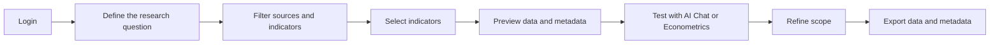

# Using Ecodata Overview

Ecodata is an economic data platform for research, policy analysis, and quantitative modeling. The application focuses on three practical jobs: finding the right data source, selecting the right indicators, and exporting datasets with metadata so users can audit and reproduce their research workflow.

This documentation replaces the previous source-by-source guide with articles organized around in-app workflows. New users should start with [Login -> Filter/Select -> Preview -> Export](/ecodata/bat-dau/login-filter-preview-export), then read the detailed indicator guides for each data group.

## Main Feature Groups

| Group | App module | What users do |
| --- | --- | --- |
| Global Data | Dashboard, Export Panel | Find international indicators from World Bank, IMF, OECD, Eurostat, ILO, FAO, WTO, ADB, and related sources. |
| Vietnam GSO | GSO Explorer | Explore KTXH, NGTK-CN, NGTK-TINH, and VHLSS aggregate indicators by year, province, and indicator group. |
| Customs | Customs Explorer | Filter import-export reports by commodity, partner country, province, transport mode, and reporting period. |
| Macro Survey | Survey Explorer | Find PCI, PAPI, ICT, PAR, and SIPAS indicators by province and year. |
| VHLSS Micro | Variable Hub | Select waves, datasets, and variables, preview records, and create panel or pooled datasets. |
| Stock Hub | Stocks | View prices, symbols, financial statements, notes, and corporate events. |
| AI Chat | Chat | Ask AI to suggest indicators, sources, model variables, and data queries. |
| Econometrics | Analysis | Run preliminary OLS, WLS, GLS, panel, VAR, ARIMA, Logit, and Probit models before export. |

## Standard Research Workflow

## Indicator Selection Principles

1. Choose the source by unit of analysis first: country, province, firm, commodity, household, or individual.
2. Check coverage by year, frequency, geography, and completeness before adding an indicator to export.
3. Read metadata to confirm definition, unit, calculation method, and provenance.
4. Preview sample data before downloading full data, especially for panel datasets or multi-source exports.
5. Keep citation, short code, and metadata together with the exported data.

## Documentation Implementation Status

The documentation is Vietnamese-first. Homepage UI strings are managed through `src/i18n/vi.json` and `src/i18n/en.json`; full article translations are managed through Docusaurus file-based i18n.
