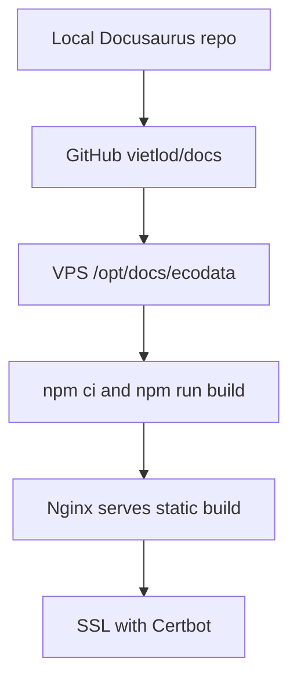

# Docusaurus and VPS Integration Plan

The documentation repo is standardized as a Docusaurus app for "Using Ecodata". The deployment goal is to synchronize the local repo, GitHub repo, and VPS documentation directory, then configure domain, Nginx, and SSL.

## Local and VPS State

| Item | State |
| --- | --- |
| Local repo | `D:\DOCS\ecodata` |
| GitHub repo | `https://github.com/vietlod/docs` |
| App name | Using Ecodata |
| Default content | Vietnamese |
| Target docs domain | `ecodata.tnsai.vn` |
| App domain for feature reference | `ecodata.io.vn` |
| VPS path | `/opt/docs/ecodata` |

## Pre-Deploy Checklist

1. Confirm the final documentation and app domains.
2. Confirm that the DNS A record points to the VPS.
3. SSH into the VPS and check `/opt/docs`.
4. Check active ports with `ss -tulpn`.
5. Check Nginx sites-enabled and sites-available.
6. Verify that the Ecodata app containers remain untouched.
7. Build Docusaurus locally or on the VPS.
8. Configure SSL only after the domain resolves correctly.

## Recommended Deployment Flow

## Nginx

Nginx should serve the static Docusaurus build. There is no need to run a dev server. The documentation server block must stay separate from the Ecodata production app so it does not affect backend, frontend, Redis, adapter, or Python service ports.

## Scope Not Touched

The `ecodata.io.vn` domain belongs to the production Ecodata app and is used only as a feature reference. The documentation deployment does not change app code, containers, the `/opt/ecodata` directory, or the app's Nginx block.
