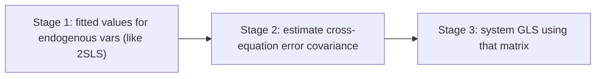

# 3SLS — Three-Stage Least Squares

**3SLS (Three-Stage Least Squares)** estimates a **system of simultaneous equations** where endogenous variables appear in multiple equations and the **errors are correlated across equations**. 3SLS combines [2SLS](/en/ecolab/mo-hinh/iv-2sls) (handling endogeneity) with [GLS](/en/ecolab/mo-hinh/gls) (exploiting cross-equation correlation) ⇒ more efficient than equation-by-equation 2SLS.

:::tip When to use
Use 3SLS when the model is a **system of structural equations** with endogeneity (e.g. supply–demand, macro systems) and the equation errors are correlated. For a single equation ⇒ use 2SLS.
:::

---

## Three stages

---

## Running in EcoLab

1. **Modeling** module → *IV & simultaneous equations* family → **3SLS**.
2. Declare the **system equations**, endogenous variables and shared instruments.
3. Run; read system-wide coefficients; compare with equation-by-equation 2SLS; export the **replication code**.

---

## Limitations

- **Misspecification in one equation** can propagate across the system (less robust than single-equation estimation).
- Requires full identification for every equation.

## See also

- [IV/2SLS](/en/ecolab/mo-hinh/iv-2sls) · [SUR](/en/ecolab/mo-hinh/sur) · [Catalog](/en/ecolab/mo-hinh/danh-muc)
