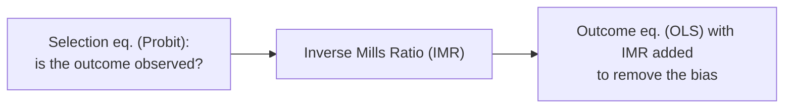

# Heckman — Sample selection model (Heckit)

The **Heckman model (Heckit)** corrects **sample selection bias** — when whether an observation has an outcome value **depends on factors** related to that outcome. Example: we only observe **wages** of people **who work**; the working sample is non-random ⇒ OLS is biased.

:::tip When to use
Use Heckman when the outcome sample is **endogenously selected** (e.g. wage ↔ labor-force participation). You need an **exclusion restriction**: a variable that affects *being selected* but not the *outcome* directly.
:::

---

## Two-equation structure

- **Selection equation**: $S_i = 1[Z_i \gamma + u_i > 0]$ (Probit).
- **Outcome equation**: $Y_i = X_i \beta + \rho \sigma_\varepsilon \, \lambda(Z_i \gamma) + \xi_i$, where $\lambda(\cdot)$ is the **inverse Mills ratio (IMR)**.

A significant IMR coefficient ⇒ **sample selection bias is present** (and Heckman is warranted).

---

## Two estimation approaches

| Approach | Description |
| :--- | :--- |
| **Two-step (Heckit)** | Step 1 Probit selection → compute IMR; step 2 OLS outcome with IMR |
| **MLE** | Estimate both equations jointly (more efficient) |

---

## Running in EcoLab

1. **Modeling** module → *Limited dependent variable* family → **Heckman**.
2. Declare the **outcome equation** ($Y$, $X$) and the **selection equation** ($Z$, including the exclusion variable).
3. Choose two-step or MLE; run; read the IMR coefficient ($\rho$) to confirm bias; export the **replication code**.

---

## Limitations

- **Heavily depends on a valid exclusion restriction**; without it, the model is poorly identified (collinearity with the IMR).
- Sensitive to the bivariate-normal error assumption.

## See also

- [Probit](/en/ecolab/mo-hinh/probit) · [Tobit](/en/ecolab/mo-hinh/tobit) · [Truncated](/en/ecolab/mo-hinh/truncated) · [Catalog](/en/ecolab/mo-hinh/danh-muc)
