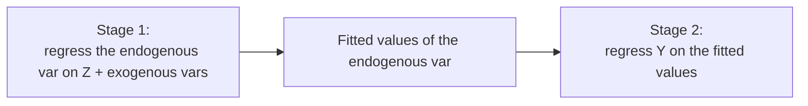

# IV / 2SLS — Instrumental Variables & Two-Stage Least Squares

**IV/2SLS** handles **endogeneity** — when a regressor is correlated with the error (due to omitted variables, measurement error, or simultaneity). In that case [OLS](/en/ecolab/mo-hinh/ols) is **biased and inconsistent**. IV uses an **instrument** to isolate the exogenous part of the endogenous variable.

:::warning Valid-instrument conditions
A valid instrument $Z$ must be: (1) **relevant** — correlated with the endogenous variable; (2) **exogenous (exclusion)** — affecting $Y$ only **through** the endogenous variable, not directly. A weak instrument causes severe bias.
:::

---

## Two-stage mechanism

$$
\hat{\beta}_{2SLS} = (X' P_Z X)^{-1} X' P_Z Y, \qquad P_Z = Z(Z'Z)^{-1}Z'
$$

---

## Required tests

- **Weak instrument**: first-stage F-statistic (rule of thumb: F > 10).
- **Endogeneity**: Durbin-Wu-Hausman test (is IV needed?).
- **Overidentification**: Sargan/Hansen J test (when instruments > endogenous variables).

---

## Running in EcoLab

1. **Modeling** module → *IV & simultaneous equations* family → **IV/2SLS**.
2. Declare $Y$, the exogenous variables, the **endogenous variable(s)** and the **instrument(s)** $Z$.
3. Run; read the first-stage F, 2SLS coefficients, Sargan/Hansen; export the **replication code**.

---

## Limitations

- **Weak/invalid instruments** make IV worse than OLS.
- Finding good instruments is usually hard; needs strong theoretical justification.

## See also

- [3SLS](/en/ecolab/mo-hinh/3sls) · [SUR](/en/ecolab/mo-hinh/sur) · [Catalog](/en/ecolab/mo-hinh/danh-muc)
