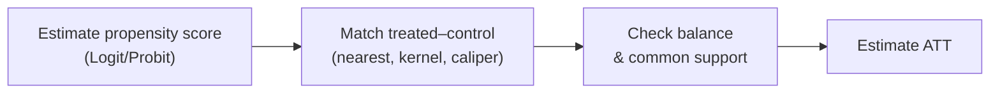

# PSM — Propensity Score Matching

**PSM (Propensity Score Matching)** evaluates the **impact of an intervention** on observational data by **matching** each **treated** unit with a **control** unit that has a similar **propensity score** — the estimated probability of participation given observed variables. The goal is to mimic a randomized experiment and reduce selection bias on **observables**.

:::warning Key assumption
PSM relies on **selection on observables (CIA)**: every factor affecting both participation and outcome is **observed**. If there are **unobserved confounders**, PSM remains biased (unlike [IV](/en/ecolab/mo-hinh/iv-2sls)/[DiD](/en/ecolab/mo-hinh/did), which partly address unobservables).
:::

---

## Workflow

The propensity score $p(X) = P(\text{treat}=1 \mid X)$ is estimated by [Logit](/en/ecolab/mo-hinh/logit)/[Probit](/en/ecolab/mo-hinh/probit).

---

## Running in EcoLab

1. **Modeling** module → *Causal inference* family → **PSM**.
2. Declare the treatment, outcome, and covariates; choose the matching algorithm.
3. Run; check **balance** + common support; read the **ATT**; export the **replication code**.

## Limitations

- Does not handle **unobserved confounders**.
- Sensitive to the matching algorithm; balance must be checked carefully.

## See also

- [DiD](/en/ecolab/mo-hinh/did) · [RDD](/en/ecolab/mo-hinh/rdd) · [Catalog](/en/ecolab/mo-hinh/danh-muc)
