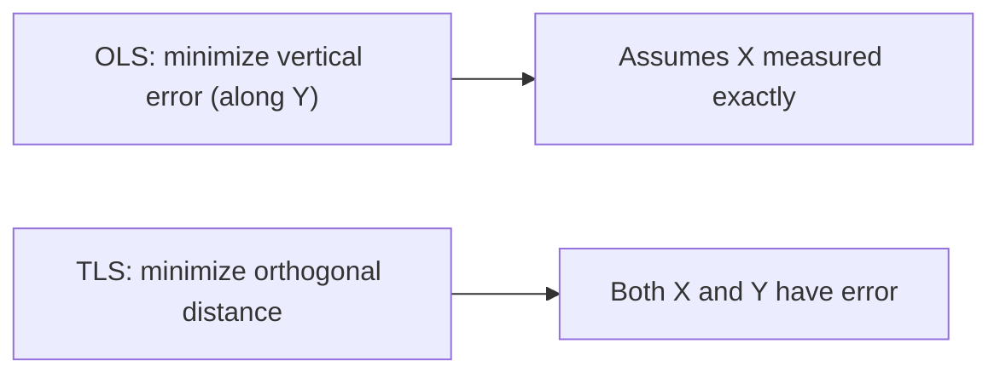

# TLS — Total Least Squares

**TLS (Total Least Squares)** — also called orthogonal regression — handles the case where **both the regressors $X$ and the dependent variable $Y$ contain measurement error** (errors-in-variables). Whereas [OLS](/en/ecolab/mo-hinh/ols) only minimizes error along the $Y$ direction, TLS minimizes the **orthogonal distance** from each data point to the regression line.

:::tip When to use
Use TLS when $X$ is **measured with error**. OLS then yields coefficients **biased toward zero (attenuation bias)**; TLS mitigates this.
:::

---

## Intuition

OLS minimizes $\sum (Y_i - \hat{Y}_i)^2$ (along the $Y$ axis); TLS minimizes the sum of **squared perpendicular distances** from each point $(X_i, Y_i)$ to the regression line.

---

## Model specification

For the errors-in-variables model $Y_i = \beta_0 + \beta_1 X_i^{*} + \varepsilon_i$ where we only observe $X_i = X_i^{*} + u_i$ (with noise $u_i$), TLS estimates $\beta$ via the singular value decomposition (SVD) of the augmented data matrix $[X \mid Y]$.

---

## Running in EcoLab

1. **Modeling** module → *Classical linear regression* family → **TLS**.
2. Select $Y$ and the $X$ variables suspected of measurement error.
3. Run and **compare coefficients with OLS** to see the attenuation correction; export the **replication code**.

---

## Limitations

- Requires an assumption about the **error-variance ratio** between $X$ and $Y$.
- If a good instrument is available, [IV/2SLS](/en/ecolab/mo-hinh/danh-muc) is a common alternative for errors-in-variables.

## See also

- [OLS](/en/ecolab/mo-hinh/ols) · [GLS](/en/ecolab/mo-hinh/gls) · [Model catalog](/en/ecolab/mo-hinh/danh-muc)
