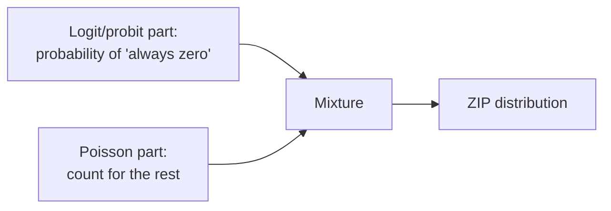

# ZIP — Zero-Inflated Poisson

**ZIP (Zero-Inflated Poisson)** handles count data with **excess zeros** beyond what Poisson predicts, when zeros arise from **two different mechanisms**: an "always zero" group (structural zeros) and a Poisson-count group (which may incidentally be zero).

:::tip When to use
Use ZIP when count data has **many zeros** and you believe there is a group for which "the event never happens" (e.g. cigarettes/day: non-smokers are always 0).
:::

---

## Two-part mixture structure

$$
P(Y_i = 0) = \pi_i + (1 - \pi_i) e^{-\mu_i}, \qquad P(Y_i = y) = (1 - \pi_i) \frac{e^{-\mu_i}\mu_i^{y}}{y!}, \; y \ge 1
$$

where $\pi_i$ (probability of a structural zero) is modeled by logit/probit; $\mu_i = \exp(X_i\beta)$.

---

## Running in EcoLab

1. **Modeling** module → *Count data* family → **ZIP**.
2. Declare variables for the **count part** ($X$) and the **inflation part** (predictors of "always zero").
3. Run; compare with Poisson via the **Vuong test**; export the **replication code**.

---

## Limitations

- If the count part is still **overdispersed** ⇒ [ZINB](/en/ecolab/mo-hinh/zinb).
- More complex interpretation (two equations); needs clear theory for the zero mechanism.

## See also

- [Poisson](/en/ecolab/mo-hinh/poisson) · [ZINB](/en/ecolab/mo-hinh/zinb) · [Negative Binomial](/en/ecolab/mo-hinh/negbin) · [Catalog](/en/ecolab/mo-hinh/danh-muc)
