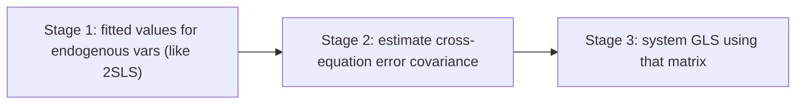

import Tabs from '@theme/Tabs';
import TabItem from '@theme/TabItem';
import VideoTutorial from '@site/src/components/VideoTutorial';

# 3SLS — Three-Stage Least Squares

**3SLS (Three-Stage Least Squares)** estimates a **system of simultaneous equations** where endogenous variables appear in multiple equations and the **errors are correlated across equations**. 3SLS combines [2SLS](/en/ecolab/model/iv-2sls) (handling endogeneity) with [GLS](/en/ecolab/model/gls) (exploiting cross-equation correlation) ⇒ more efficient than equation-by-equation 2SLS.

:::tip When to use
Use 3SLS when the model is a **system of structural equations** with endogeneity (e.g. supply–demand, macro systems) and the equation errors are correlated. For a single equation ⇒ use 2SLS.
:::

---

## Three stages



---

## Running in EcoLab

1. **Modeling** module → *IV & simultaneous equations* family → **3SLS**.
2. Declare the **system equations**, endogenous variables and shared instruments.
3. Run; read system-wide coefficients; compare with equation-by-equation 2SLS; export the **replication code**.

---

## Replication code

<Tabs groupId="lang">
  <TabItem value="stata" label="Stata" default>

```stata
* ── 3SLS: supply–demand system ────────────────────
* Demand equation: q depends on p and income
* Supply equation: q depends on p and cost
reg3 (demand: q p income) (supply: q p cost), 3sls

* View system-wide results
estimates table
```

  </TabItem>
  <TabItem value="r" label="R">

```r
# ── 3SLS: supply–demand system ────────────────────
library(systemfit)

# Define the system of equations
eq_demand <- q ~ p + income
eq_supply <- q ~ p + cost
sys <- list(demand = eq_demand, supply = eq_supply)

# Estimate with 3SLS; instruments = all exogenous vars
model_3sls <- systemfit(sys, method = "3SLS",
                        inst = ~ income + cost,
                        data = df)
summary(model_3sls)
```

  </TabItem>
  <TabItem value="python" label="Python">

```python
# ── 3SLS: supply–demand system ────────────────────
# Python does not have a mature dedicated 3SLS package.
# Option 1: Use linearmodels for each equation via IV2SLS,
#            then manually iterate with the cross-equation
#            error covariance (FGLS step).
# Option 2: Use the systemfit-style approach below.

from linearmodels.iv import IV2SLS
import numpy as np

# Stage 1–2: estimate each equation by 2SLS
res_demand = IV2SLS(
    df["q"], df[["income"]], df[["p"]], df[["cost"]]
).fit()
res_supply = IV2SLS(
    df["q"], df[["cost"]], df[["p"]], df[["income"]]
).fit()

# Stage 3: use residuals to build Σ, then system GLS
# (manual implementation — see textbook for full procedure)
print(res_demand)
print(res_supply)
```

  </TabItem>
</Tabs>

---

## Limitations

- **Misspecification in one equation** can propagate across the system (less robust than single-equation estimation).
- Requires full identification for every equation.

## Video tutorial

<VideoTutorial
  title="Guide to running 3SLS in EcoLab"
  src="https://www.youtube.com/user/vietlod"
/>

## See also

- [IV/2SLS](/en/ecolab/model/iv-2sls) · [SUR](/en/ecolab/model/sur) · [Catalog](/en/ecolab/model/group)
