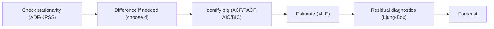

import Tabs from '@theme/Tabs';
import TabItem from '@theme/TabItem';
import VideoTutorial from '@site/src/components/VideoTutorial';

# AR / MA / ARMA / ARIMA — The Box-Jenkins family

This is the classic family of **univariate time-series** models that describe and **forecast** a series from its own past:

- **AR(p)** — Autoregressive: $Y_t$ depends on its own lagged values.
- **MA(q)** — Moving Average: $Y_t$ depends on lagged errors (shocks).
- **ARMA(p,q)** — combines AR and MA for **stationary** series.
- **ARIMA(p,d,q)** — adds **differencing of order $d$** to handle **non-stationary** series.

:::tip When to use
Use for **forecasting a single series** (revenue, inflation, prices). Check **stationarity** first (ADF/KPSS); if non-stationary, difference it (order $d$) ⇒ ARIMA. Seasonal ⇒ [SARIMA](/en/ecolab/model/sarima); volatility clustering ⇒ [GARCH](/en/ecolab/model/garch).
:::

---

## Model specification

ARMA(p,q):

$$
Y_t = c + \sum_{i=1}^{p} \phi_i Y_{t-i} + \varepsilon_t + \sum_{j=1}^{q} \theta_j \varepsilon_{t-j}
$$

ARIMA(p,d,q): apply ARMA(p,q) to the $d$-times differenced series $\Delta^d Y_t$.

---

## Box-Jenkins workflow



---

## Running in EcoLab

1. **Modeling** module → *Univariate time series* family → **ARIMA**.
2. Choose the series $Y$; declare $(p,d,q)$ or use auto-ARIMA (AIC/BIC).
3. Run; view residual diagnostics + **forecasts** with confidence intervals; export the **replication code**.

---

## Replication code

<Tabs groupId="lang">
  <TabItem value="stata" label="Stata" default>

```stata
* --- ARIMA(1,1,1) ---
* Declare time variable
tsset time

* Estimate ARIMA(1,1,1) by MLE
arima gdp_growth, arima(1,1,1)

* Post-estimation diagnostics
predict resid, residuals
corrgram resid, lags(20)

* Forecast
tsappend, add(12)
predict yhat, dynamic(.)
```

  </TabItem>
  <TabItem value="r" label="R">

```r
# --- ARIMA ---
library(forecast)

# Convert to time series object
ts_data <- ts(df$gdp_growth, start = c(1990, 1), frequency = 4)

# Auto-select (p,d,q) by AIC
fit <- auto.arima(ts_data)
summary(fit)

# Residual diagnostics
checkresiduals(fit)

# Forecast 12 periods ahead
fc <- forecast(fit, h = 12)
plot(fc)
```

  </TabItem>
  <TabItem value="python" label="Python">

```python
from statsmodels.tsa.arima.model import ARIMA
import matplotlib.pyplot as plt

# Estimate ARIMA(1,1,1)
model = ARIMA(df['gdp_growth'], order=(1, 1, 1))
result = model.fit()
print(result.summary())

# Residual diagnostics
result.plot_diagnostics(figsize=(10, 6))
plt.tight_layout(); plt.show()

# Forecast 12 periods
forecast = result.get_forecast(steps=12)
print(forecast.summary_frame())
```

  </TabItem>
</Tabs>

---

## Limitations

- Assumes a **linear** relationship and stable structure; weak under structural breaks.
- Does not model **time-varying variance** ⇒ use ARCH/GARCH.

## Video tutorial

<VideoTutorial
  title="Running ARIMA in EcoLab"
  src="https://www.youtube.com/user/vietlod"
/>

## See also

- [SARIMA](/en/ecolab/model/sarima) · [GARCH](/en/ecolab/model/garch) · [ARDL](/en/ecolab/model/ardl) · [Catalog](/en/ecolab/model/group)
