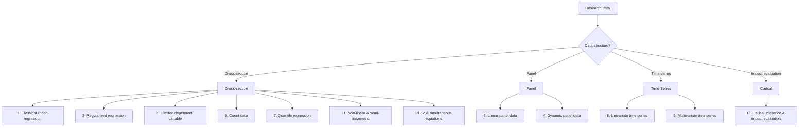
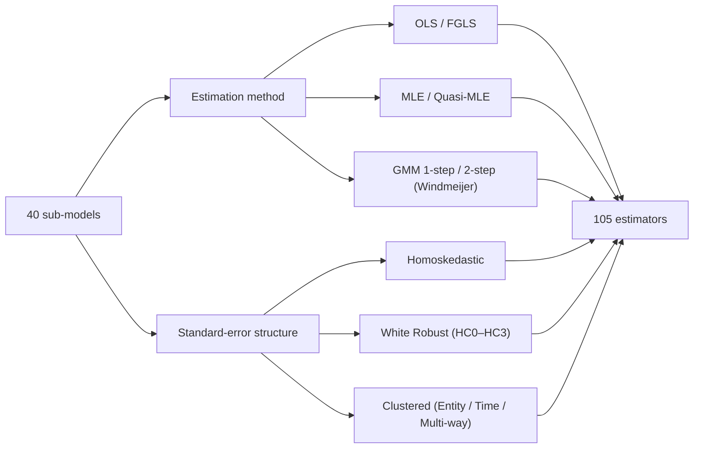
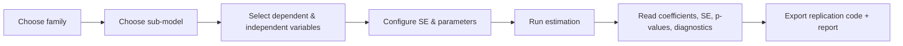

# Econometric model & estimator catalog

EcoData/EcoLab integrates a comprehensive **Econometrics Engine** with **12 major model families**, broken down into **40 sub-models** and **105 estimators**. This page is the overview map: it helps you choose the right family for your data structure and research question, and explains how the 105 estimators are formed.

:::tip Test feasibility before investing further
Run a quick estimation on real data to confirm your topic **has data, statistical significance and reproducibility** before writing a thesis or paper. Every estimation exports **replication code** for Stata/R/Python.
:::

---

## Map of the 12 model families

---

## Family → sub-model table

| # | Model family | Representative sub-models | When to use |
| :--- | :--- | :--- | :--- |
| 1 | **Classical linear regression** | OLS, WLS, GLS, TLS | Linear relationships, baseline cross-section |
| 2 | **Regularized regression** | Ridge, Lasso, Elastic Net, Adaptive Lasso | Many regressors, multicollinearity, variable selection |
| 3 | **Linear panel data** | Pooled OLS, [Fixed Effects](/en/ecolab/model/fem-rem), [Random Effects](/en/ecolab/model/fem-rem), Between | Many units × many periods |
| 4 | **Dynamic panel data** | [Arellano-Bond (Diff GMM)](/en/ecolab/model/gmm), [Blundell-Bond (System GMM)](/en/ecolab/model/gmm) | Lagged variable, endogeneity, large N small T |
| 5 | **Limited dependent variable** | Logit, Probit, Tobit, Truncated, Heckman | Binary, censored, sample-selected outcomes |
| 6 | **Count data** | Poisson, Negative Binomial, ZIP, ZINB | Count outcomes (non-negative integers) |
| 7 | **Quantile regression** | Linear Quantile, Panel FE-QR | Effects across different quantiles |
| 8 | **Univariate time series** | AR, MA, ARMA, ARIMA, SARIMA, ARCH, GARCH, EGARCH | Forecasting, volatility of one series |
| 9 | **Multivariate time series** | [VAR](/en/ecolab/model/vecm), [VECM](/en/ecolab/model/vecm), SVAR | Multi-variable systems, cointegration |
| 10 | **IV & simultaneous equations** | IV/2SLS, 3SLS, SUR | Endogeneity, equation systems |
| 11 | **Non-linear & semi-parametric** | NLS, GAM | Non-linear relationships |
| 12 | **Causal inference** | [DiD](/en/ecolab/model/did), PSM, RDD | Policy impact evaluation |

> In addition, [ARDL](/en/ecolab/model/ardl) (Autoregressive Distributed Lag) supports long-run/short-run relationships for time series with mixed I(0)/I(1) integration orders.

---

## How are the 105 estimators formed?

The **40 sub-models** correspond to distinct **mathematical specifications**. To serve academic research that requires coefficient robustness, each sub-model can be combined with several **optimization methods** and **standard-error structures** — yielding **105 estimators**.

| Component | Options |
| :--- | :--- |
| **Optimization method** | OLS, FGLS, Maximum Likelihood (MLE), Quasi-MLE, GMM (1-step/2-step with Windmeijer correction) |
| **Standard-error structure** | Homoskedastic; White Robust (HC0, HC1, HC2, HC3); Clustered by Entity, Time or Multi-way |

:::info Robust standard errors
Choosing the right standard-error structure controls for **heteroskedasticity** and **autocorrelation** — a decisive factor for the reliability of statistical inference (t-stats, p-values, confidence intervals).
:::

---

## Estimation workflow

1. In the **Modeling** module, choose the **family** by data structure.
2. Choose the **sub-model** (specific specification).
3. Declare the dependent variable $Y$ and the independent variables $X_1, \dots, X_k$.
4. Choose the **standard-error structure** (Homoskedastic / Robust / Clustered) and advanced parameters.
5. Run and read the **estimation table**, **diagnostics**, **robustness**; export the **replication code**.

---

## Choosing a model by data structure

| Data structure | Preferred family |
| :--- | :--- |
| Cross-section, continuous $Y$ | Classical linear regression; regularized if many regressors |
| Binary / discrete / censored $Y$ | Limited dependent variable; count data |
| Panel (N units × T periods) | Linear panel (FE/RE); dynamic panel (GMM) if lagged variable |
| Single time series | ARIMA/SARIMA; ARCH/GARCH for volatility |
| Multiple time-series system | VAR/VECM/SVAR |
| Policy impact evaluation | DiD, PSM, RDD, IV |

---

## See also

- [Estimation & Modeling](/en/ecolab/econometrics-modeling) — detailed workflow
- Family detail pages: [Panel data (FEM/REM)](/en/ecolab/model/fem-rem) · [Dynamic panel (GMM)](/en/ecolab/model/gmm) · [ARDL](/en/ecolab/model/ardl) · [VECM](/en/ecolab/model/vecm) · [DiD](/en/ecolab/model/did)
- Worked examples: [FDI & growth (ARDL)](/en/ecolab/vi-du/fdi-tang-truong-ardl) · [Public debt & growth (panel)](/en/ecolab/vi-du/no-cong-tang-truong-panel)
