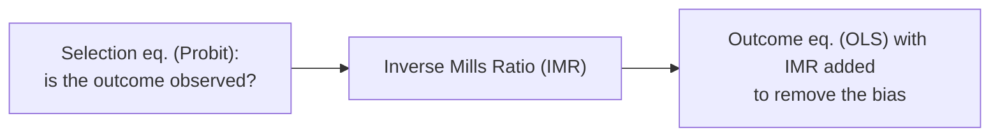

import Tabs from '@theme/Tabs';
import TabItem from '@theme/TabItem';
import VideoTutorial from '@site/src/components/VideoTutorial';

# Heckman — Sample selection model (Heckit)

The **Heckman model (Heckit)** corrects **sample selection bias** — when whether an observation has an outcome value **depends on factors** related to that outcome. Example: we only observe **wages** of people **who work**; the working sample is non-random ⇒ OLS is biased.

:::tip When to use
Use Heckman when the outcome sample is **endogenously selected** (e.g. wage ↔ labor-force participation). You need an **exclusion restriction**: a variable that affects *being selected* but not the *outcome* directly.
:::

---

## Two-equation structure



- **Selection equation**: $S_i = 1[Z_i \gamma + u_i > 0]$ (Probit).
- **Outcome equation**: $Y_i = X_i \beta + \rho \sigma_\varepsilon \, \lambda(Z_i \gamma) + \xi_i$, where $\lambda(\cdot)$ is the **inverse Mills ratio (IMR)**.

A significant IMR coefficient ⇒ **sample selection bias is present** (and Heckman is warranted).

---

## Two estimation approaches

| Approach | Description |
| :--- | :--- |
| **Two-step (Heckit)** | Step 1 Probit selection → compute IMR; step 2 OLS outcome with IMR |
| **MLE** | Estimate both equations jointly (more efficient) |

---

## Running in EcoLab

1. **Modeling** module → *Limited dependent variable* family → **Heckman**.
2. Declare the **outcome equation** ($Y$, $X$) and the **selection equation** ($Z$, including the exclusion variable).
3. Choose two-step or MLE; run; read the IMR coefficient ($\rho$) to confirm bias; export the **replication code**.

---

## Replication code

<Tabs groupId="lang">
  <TabItem value="stata" label="Stata" default>

```stata
* ===== Heckman Selection Model (Heckit) =====
* Two-step estimator
* Outcome eq.: lnwage = f(educ, exper)
* Selection eq.: working = f(married, kids)  ← exclusion restriction
heckman lnwage educ exper, select(working = married kids)

* MLE estimator (more efficient)
heckman lnwage educ exper, select(working = married kids) twostep

* Key output:
* - mills (lambda): significant → selection bias present
* - rho: correlation between selection and outcome errors
* - sigma: std. deviation of outcome error
```

  </TabItem>
  <TabItem value="r" label="R">

```r
# ===== Heckman Selection Model (Heckit) =====
library(sampleSelection)

# Two-step Heckit estimator
# Selection eq.: working ~ married + kids
# Outcome eq.:   lnwage ~ educ + exper
model <- heckit(
  selection = working ~ married + kids,
  outcome   = lnwage ~ educ + exper,
  data      = df,
  method    = "2step"
)

summary(model)

# MLE estimator
model_ml <- heckit(
  selection = working ~ married + kids,
  outcome   = lnwage ~ educ + exper,
  data      = df,
  method    = "ml"
)

summary(model_ml)

# Key: check the inverse Mills ratio (IMR) coefficient
# and rho (correlation between errors)
```

  </TabItem>
  <TabItem value="python" label="Python">

```python
# ===== Heckman Selection Model — Two-step manual =====
import numpy as np
import statsmodels.api as sm
from scipy.stats import norm

# Step 1: Probit selection equation
Z = sm.add_constant(df[["married", "kids"]])
sel_model = sm.Probit(df["working"], Z).fit()

# Compute the Inverse Mills Ratio (IMR / lambda)
Zg = sel_model.predict(Z)          # linear index P(working=1)
imr = norm.pdf(norm.ppf(Zg)) / Zg  # IMR = phi(Phi^{-1}(p)) / p

# Step 2: OLS outcome equation with IMR added
# Only for observations where working == 1
subset = df[df["working"] == 1].copy()
X = sm.add_constant(subset[["educ", "exper"]])
X["imr"] = imr[df["working"] == 1]

outcome_model = sm.OLS(subset["lnwage"], X).fit()
print(outcome_model.summary())

# Key: if the IMR coefficient is significant,
# sample selection bias is confirmed
print("IMR coefficient:", outcome_model.params["imr"])
print("IMR p-value:", outcome_model.pvalues["imr"])
```

  </TabItem>
</Tabs>

---

## Limitations

- **Heavily depends on a valid exclusion restriction**; without it, the model is poorly identified (collinearity with the IMR).
- Sensitive to the bivariate-normal error assumption.

## Video tutorial

<VideoTutorial
  title="Guide to running Heckman selection model in EcoLab"
  src="https://www.youtube.com/user/vietlod"
/>

## See also

- [Probit](/en/ecolab/model/probit) · [Tobit](/en/ecolab/model/tobit) · [Truncated](/en/ecolab/model/truncated) · [Catalog](/en/ecolab/model/group)
