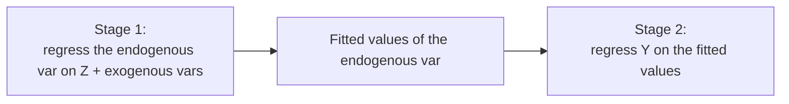

import Tabs from '@theme/Tabs';
import TabItem from '@theme/TabItem';
import VideoTutorial from '@site/src/components/VideoTutorial';

# IV / 2SLS — Instrumental Variables & Two-Stage Least Squares

**IV/2SLS** handles **endogeneity** — when a regressor is correlated with the error (due to omitted variables, measurement error, or simultaneity). In that case [OLS](/en/ecolab/model/ols) is **biased and inconsistent**. IV uses an **instrument** to isolate the exogenous part of the endogenous variable.

:::warning Valid-instrument conditions
A valid instrument $Z$ must be: (1) **relevant** — correlated with the endogenous variable; (2) **exogenous (exclusion)** — affecting $Y$ only **through** the endogenous variable, not directly. A weak instrument causes severe bias.
:::

---

## Two-stage mechanism



$$
\hat{\beta}_{2SLS} = (X' P_Z X)^{-1} X' P_Z Y, \qquad P_Z = Z(Z'Z)^{-1}Z'
$$

---

## Required tests

- **Weak instrument**: first-stage F-statistic (rule of thumb: F > 10).
- **Endogeneity**: Durbin-Wu-Hausman test (is IV needed?).
- **Overidentification**: Sargan/Hansen J test (when instruments > endogenous variables).

---

## Running in EcoLab

1. **Modeling** module → *IV & simultaneous equations* family → **IV/2SLS**.
2. Declare $Y$, the exogenous variables, the **endogenous variable(s)** and the **instrument(s)** $Z$.
3. Run; read the first-stage F, 2SLS coefficients, Sargan/Hansen; export the **replication code**.

---

## Replication code

<Tabs groupId="lang">
  <TabItem value="stata" label="Stata" default>

```stata
* ── IV / 2SLS estimation ──────────────────────────
* Endogenous: educ | Instruments: near_college, parent_educ
ivregress 2sls lnwage exper (educ = near_college parent_educ), first

* ── Post-estimation diagnostics ───────────────────
estat firststage        // First-stage F (rule of thumb: F > 10)
estat endogenous        // Durbin-Wu-Hausman endogeneity test
estat overid            // Sargan / Hansen J overidentification test
```

  </TabItem>
  <TabItem value="r" label="R">

```r
# ── IV / 2SLS estimation ──────────────────────────
library(AER)

model_iv <- ivreg(
  lnwage ~ educ + exper | near_college + parent_educ + exper,
  data = df
)

# ── Summary with built-in diagnostics ────────────
# Reports: Weak instruments, Wu-Hausman, Sargan
summary(model_iv, diagnostics = TRUE)
```

  </TabItem>
  <TabItem value="python" label="Python">

```python
# ── IV / 2SLS estimation ──────────────────────────
from linearmodels.iv import IV2SLS

# Define variables
dep      = df["lnwage"]          # Dependent variable
exog     = df[["exper"]]         # Exogenous regressors
endog    = df[["educ"]]          # Endogenous regressor
instr    = df[["near_college",
               "parent_educ"]]   # Instruments

model = IV2SLS(dep, exog, endog, instr)
results = model.fit(cov_type="robust")
print(results)

# First-stage diagnostics are included in the output
# Check: first_stage.diagnostics for F-stat, Sargan, etc.
```

  </TabItem>
</Tabs>

---

## Limitations

- **Weak/invalid instruments** make IV worse than OLS.
- Finding good instruments is usually hard; needs strong theoretical justification.

## Video tutorial

<VideoTutorial
  title="Guide to running IV/2SLS in EcoLab"
  src="https://www.youtube.com/user/vietlod"
/>

## See also

- [3SLS](/en/ecolab/model/3sls) · [SUR](/en/ecolab/model/sur) · [Catalog](/en/ecolab/model/group)
