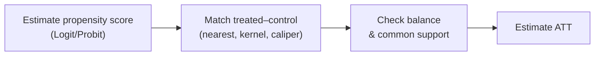

---
title: PSM — Propensity Score Matching
sidebar_position: 2
description: Propensity Score Matching (PSM) evaluates impact by matching treated and control units with similar participation probabilities, and how to run it in EcoLab.
---

import Tabs from '@theme/Tabs';
import TabItem from '@theme/TabItem';
import VideoTutorial from '@site/src/components/VideoTutorial';

# PSM — Propensity Score Matching

**PSM (Propensity Score Matching)** evaluates the **impact of an intervention** on observational data by **matching** each **treated** unit with a **control** unit that has a similar **propensity score** — the estimated probability of participation given observed variables. The goal is to mimic a randomized experiment and reduce selection bias on **observables**.

:::warning Key assumption
PSM relies on **selection on observables (CIA)**: every factor affecting both participation and outcome is **observed**. If there are **unobserved confounders**, PSM remains biased (unlike [IV](/en/ecolab/model/iv-2sls)/[DiD](/en/ecolab/model/did), which partly address unobservables).
:::

---

## Workflow



The propensity score $p(X) = P(\text{treat}=1 \mid X)$ is estimated by [Logit](/en/ecolab/model/logit)/[Probit](/en/ecolab/model/probit).

---

## Running in EcoLab

1. **Modeling** module → *Causal inference* family → **PSM**.
2. Declare the treatment, outcome, and covariates; choose the matching algorithm.
3. Run; check **balance** + common support; read the **ATT**; export the **replication code**.

---

## Replication code

<Tabs groupId="lang">
  <TabItem value="stata" label="Stata" default>

```stata
* ── PSM: nearest-neighbor matching ────────────────
* Install: ssc install psmatch2
psmatch2 treated x1 x2 x3, outcome(y) ///
    neighbor(1) caliper(0.05) common

* ── Balance check ─────────────────────────────────
pstest x1 x2 x3, both graph

* ATT is reported in the psmatch2 output
```

  </TabItem>
  <TabItem value="r" label="R">

```r
# ── PSM: nearest-neighbor matching ────────────────
library(MatchIt)

m <- matchit(
  treated ~ x1 + x2 + x3,
  data    = df,
  method  = "nearest",
  caliper = 0.05
)

# Balance diagnostics
summary(m)
plot(m, type = "jitter")

# Estimate ATT on matched data
library(lmtest)
matched_df <- match.data(m)
model_att  <- lm(y ~ treated, data = matched_df,
                 weights = weights)
coeftest(model_att)
```

  </TabItem>
  <TabItem value="python" label="Python">

```python
# ── PSM: propensity score matching ────────────────
# Option 1: causalinference
from causalinference import CausalModel

cm = CausalModel(
    Y = df["y"].values,
    D = df["treated"].values,
    X = df[["x1", "x2", "x3"]].values
)
cm.est_propensity_s()   # Estimate propensity score
cm.trim_s()             # Trim non-overlapping region
cm.est_via_matching()   # Nearest-neighbor matching
print(cm.estimates)

# Option 2: DoWhy (Microsoft)
# import dowhy
# model = dowhy.CausalModel(...)
```

  </TabItem>
</Tabs>

## Limitations

- Does not handle **unobserved confounders**.
- Sensitive to the matching algorithm; balance must be checked carefully.

## Video tutorial

<VideoTutorial
  title="Guide to running PSM in EcoLab"
  src="https://www.youtube.com/embed/m3wyHeBOfUE"
/>

## See also

- [DiD](/en/ecolab/model/did) · [RDD](/en/ecolab/model/rdd) · [Catalog](/en/ecolab/model/group)

