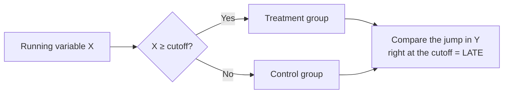

---
title: RDD — Regression Discontinuity
sidebar_position: 3
description: Regression Discontinuity Design (RDD) exploits a cutoff in a running variable to evaluate causal impact, sharp/fuzzy designs, and how to run it in EcoLab.
---

import Tabs from '@theme/Tabs';
import TabItem from '@theme/TabItem';
import VideoTutorial from '@site/src/components/VideoTutorial';

# RDD — Regression Discontinuity Design

**RDD** evaluates causal impact when treatment is determined by a **cutoff** in a **running variable** — e.g. a test score ≥ threshold qualifies for a scholarship. Comparing units **just above and just below the cutoff** (as-good-as random) yields a credible causal estimate at the threshold.

:::tip Sharp vs Fuzzy
**Sharp RDD**: crossing the cutoff ⇒ surely treated. **Fuzzy RDD**: crossing only **increases the probability** of treatment ⇒ combine with [IV](/en/ecolab/model/iv-2sls) (using the cutoff as instrument).
:::

---

## Intuition



Estimate the **jump** in $E[Y \mid X]$ at the threshold $c$; this is the local causal effect (LATE) at the cutoff.

---

## Running in EcoLab

1. **Modeling** module → *Causal inference* family → **RDD**.
2. Declare the **running variable**, **cutoff**, and outcome; choose sharp/fuzzy, bandwidth, polynomial order.
3. Run; view the RDD plot + estimate at the cutoff; run the **McCrary** test (manipulation); export the **replication code**.

---

## Replication code

<Tabs groupId="lang">
  <TabItem value="stata" label="Stata" default>

```stata
* ── RDD estimation ────────────────────────────────
* Install: ssc install rdrobust
rdrobust y score, c(50)

* ── RDD plot ──────────────────────────────────────
rdplot y score, c(50)

* ── Bandwidth selection ───────────────────────────
rdbwselect y score, c(50)
```

  </TabItem>
  <TabItem value="r" label="R">

```r
# ── RDD estimation ────────────────────────────────
library(rdrobust)

# Robust RD estimate at cutoff = 50
rd <- rdrobust(df$y, df$score, c = 50)
summary(rd)

# RDD plot
rdplot(df$y, df$score, c = 50,
       title = "RDD plot",
       x.label = "Running variable (score)",
       y.label = "Outcome (Y)")
```

  </TabItem>
  <TabItem value="python" label="Python">

```python
# ── RDD estimation ────────────────────────────────
from rdrobust import rdrobust, rdplot

# Robust RD estimate at cutoff = 50
rd = rdrobust(df["y"], df["score"], c=50)
print(rd)

# RDD plot
rdplot(df["y"], df["score"], c=50,
       title="RDD plot",
       x_label="Running variable (score)",
       y_label="Outcome (Y)")
```

  </TabItem>
</Tabs>

## Limitations

- Identifies only a **local effect at the cutoff** (LATE), not generalizable to the whole sample.
- Sensitive to **bandwidth** and functional form; check for manipulation of the running variable.

## Video tutorial

<VideoTutorial
  title="Guide to running RDD in EcoLab"
  src="https://www.youtube.com/embed/m3wyHeBOfUE"
/>

## See also

- [DiD](/en/ecolab/model/did) · [PSM](/en/ecolab/model/psm) · [IV/2SLS](/en/ecolab/model/iv-2sls) · [Catalog](/en/ecolab/model/group)

