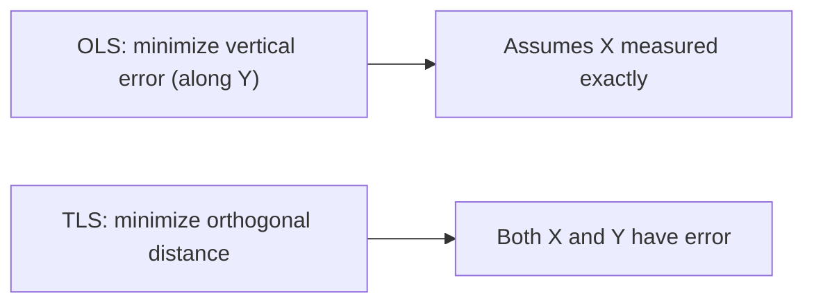

import Tabs from '@theme/Tabs';
import TabItem from '@theme/TabItem';
import VideoTutorial from '@site/src/components/VideoTutorial';

# TLS — Total Least Squares

**TLS (Total Least Squares)** — also called orthogonal regression — handles the case where **both the regressors $X$ and the dependent variable $Y$ contain measurement error** (errors-in-variables). Whereas [OLS](/en/ecolab/model/ols) only minimizes error along the $Y$ direction, TLS minimizes the **orthogonal distance** from each data point to the regression line.

:::tip When to use
Use TLS when $X$ is **measured with error**. OLS then yields coefficients **biased toward zero (attenuation bias)**; TLS mitigates this.
:::

---

## Intuition



OLS minimizes $\sum (Y_i - \hat{Y}_i)^2$ (along the $Y$ axis); TLS minimizes the sum of **squared perpendicular distances** from each point $(X_i, Y_i)$ to the regression line.

---

## Model specification

For the errors-in-variables model $Y_i = \beta_0 + \beta_1 X_i^{*} + \varepsilon_i$ where we only observe $X_i = X_i^{*} + u_i$ (with noise $u_i$), TLS estimates $\beta$ via the singular value decomposition (SVD) of the augmented data matrix $[X \mid Y]$.

---

## Running in EcoLab

1. **Modeling** module → *Classical linear regression* family → **TLS**.
2. Select $Y$ and the $X$ variables suspected of measurement error.
3. Run and **compare coefficients with OLS** to see the attenuation correction; export the **replication code**.

---

## Replication code

<Tabs groupId="lang">
  <TabItem value="stata" label="Stata" default>

```stata
* ---- TLS / Errors-in-Variables Regression ----
* Load data (illustrative)
use "measurement_data.dta", clear

* Errors-in-variables regression
* r(x1 0.9) means reliability ratio of x1 is 0.9
eivreg y x1 x2, r(x1 0.9)

* Compare with OLS (shows attenuation bias)
regress y x1 x2
```

  </TabItem>
  <TabItem value="r" label="R">

```r
# ---- TLS / Deming (Orthogonal) Regression ----
library(deming)

# Load data (illustrative)
df <- read.csv("measurement_data.csv")

# Deming regression (TLS for bivariate case)
model_tls <- deming(y ~ x, data = df)
print(model_tls)

# Compare with OLS
model_ols <- lm(y ~ x, data = df)
summary(model_ols)
```

  </TabItem>
  <TabItem value="python" label="Python">

```python
# ---- TLS / Orthogonal Distance Regression ----
from scipy.odr import ODR, Model, RealData
import numpy as np
import pandas as pd

# Load data (illustrative)
df = pd.read_csv("measurement_data.csv")

# Define the linear model for ODR
def linear_func(B, x):
    return B[0] + B[1] * x

linear_model = Model(linear_func)
data = RealData(df["x"].values, df["y"].values)

# Fit TLS via Orthogonal Distance Regression
odr = ODR(data, linear_model, beta0=[0.0, 1.0])
output = odr.run()
output.pprint()
```

  </TabItem>
</Tabs>

---

## Limitations

- Requires an assumption about the **error-variance ratio** between $X$ and $Y$.
- If a good instrument is available, [IV/2SLS](/en/ecolab/model/group) is a common alternative for errors-in-variables.

## Video tutorial

<VideoTutorial
  title="Running TLS in EcoLab"
  src="https://www.youtube.com/user/vietlod"
/>

## See also

- [OLS](/en/ecolab/model/ols) · [GLS](/en/ecolab/model/gls) · [Model catalog](/en/ecolab/model/group)
