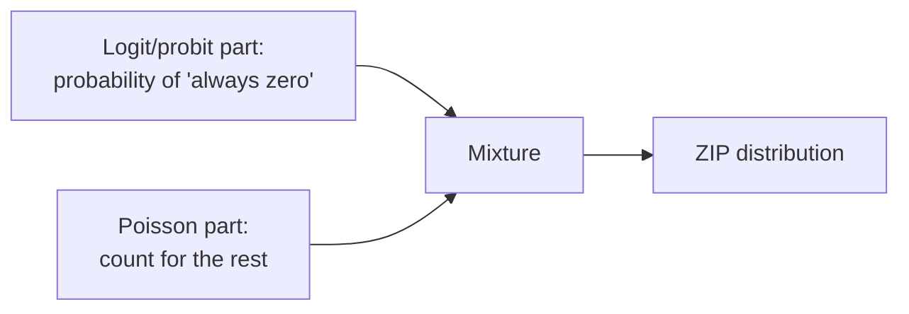

---
title: ZIP — Zero-Inflated Poisson
sidebar_position: 3
description: The Zero-Inflated Poisson (ZIP) model for count data with excess zeros from two mechanisms, the mixture structure, and how to run it in EcoLab.
---

import Tabs from '@theme/Tabs';
import TabItem from '@theme/TabItem';
import VideoTutorial from '@site/src/components/VideoTutorial';

# ZIP — Zero-Inflated Poisson

**ZIP (Zero-Inflated Poisson)** handles count data with **excess zeros** beyond what Poisson predicts, when zeros arise from **two different mechanisms**: an "always zero" group (structural zeros) and a Poisson-count group (which may incidentally be zero).

:::tip When to use
Use ZIP when count data has **many zeros** and you believe there is a group for which "the event never happens" (e.g. cigarettes/day: non-smokers are always 0).
:::

---

## Two-part mixture structure



$$
P(Y_i = 0) = \pi_i + (1 - \pi_i) e^{-\mu_i}, \qquad P(Y_i = y) = (1 - \pi_i) \frac{e^{-\mu_i}\mu_i^{y}}{y!}, \; y \ge 1
$$

where $\pi_i$ (probability of a structural zero) is modeled by logit/probit; $\mu_i = \exp(X_i\beta)$.

---

## Running in EcoLab

1. **Modeling** module → *Count data* family → **ZIP**.
2. Declare variables for the **count part** ($X$) and the **inflation part** (predictors of "always zero").
3. Run; compare with Poisson via the **Vuong test**; export the **replication code**.

---

## Replication code

<Tabs groupId="lang">
  <TabItem value="stata" label="Stata" default>

```stata
* ===== ZIP — Zero-Inflated Poisson =====
* Count part: patents ~ rd_spend + firm_size
* Inflation part: inflate(small_firm)
zip patents rd_spend firm_size, inflate(small_firm) vuong

* IRR for the count part
zip patents rd_spend firm_size, inflate(small_firm) irr

* Vuong test: significant ⇒ ZIP preferred over standard Poisson
* Shown at the bottom of the output
```

  </TabItem>
  <TabItem value="r" label="R">

```r
# ===== ZIP — Zero-Inflated Poisson =====
library(pscl)

# Count part: patents ~ rd_spend + firm_size
# Inflation part: ~ small_firm
model <- zeroinfl(patents ~ rd_spend + firm_size | small_firm,
                  data = df,
                  dist = "poisson")

summary(model)

# IRR for the count part
exp(coef(model, "count"))

# Vuong test: ZIP vs standard Poisson
model_pois <- glm(patents ~ rd_spend + firm_size,
                   data = df, family = poisson())
vuong(model, model_pois)
```

  </TabItem>
  <TabItem value="python" label="Python">

```python
# ===== ZIP — Zero-Inflated Poisson =====
import statsmodels.api as sm
import numpy as np

# Prepare data
X = sm.add_constant(df[["rd_spend", "firm_size"]])  # count part
Z = sm.add_constant(df[["small_firm"]])              # inflation part
y = df["patents"]

# Estimate ZIP model
model = sm.ZeroInflatedPoisson(y, X, exog_infl=Z).fit()
print(model.summary())

# IRR for the count part
print("IRR (count part):")
print(np.exp(model.params[:X.shape[1]]))

# Compare with standard Poisson via AIC/BIC
model_pois = sm.GLM(y, X, family=sm.families.Poisson()).fit()
print(f"AIC Poisson: {model_pois.aic:.1f}")
print(f"AIC ZIP:     {model.aic:.1f}")
```

  </TabItem>
</Tabs>

---

## Limitations

- If the count part is still **overdispersed** ⇒ [ZINB](/en/ecolab/model/zinb).
- More complex interpretation (two equations); needs clear theory for the zero mechanism.

## Video tutorial

<VideoTutorial
  title="Guide to running Zero-Inflated Poisson (ZIP) in EcoLab"
  src="https://www.youtube.com/embed/m3wyHeBOfUE"
/>

## See also

- [Poisson](/en/ecolab/model/poisson) · [ZINB](/en/ecolab/model/zinb) · [Negative Binomial](/en/ecolab/model/negbin) · [Catalog](/en/ecolab/model/group)

