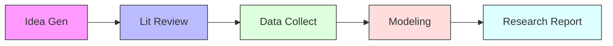

# EcoLab Overview

**EcoLab** (version v0.22.0) is an AI-powered econometrics research platform. It is designed to automate and optimize the entire academic research workflow — from initial idea generation to the final published report.

The platform integrates specialized AI agents and over 30 econometrics models to help researchers overcome technical and data bottlenecks.

---

## 1. Technology Stack

The EcoLab system is built upon a modern, industry-grade technology stack:

| Component | Integrated Technologies | Purpose |
| :--- | :--- | :--- |
| **Frontend** | Next.js 14, React 18, TypeScript, Tailwind CSS | Sleek, academic-grade user interface with smooth transitions and optimized user experience (UX). |
| **Backend** | FastAPI, Python 3.11 | High-performance REST APIs, real-time WebSockets, and AI agent orchestration. |
| **Artificial Intelligence** | DeepSeek, OpenAI, Gemini, Perplexity, OpenRouter | Multi-LLM provider ecosystem with automatic failover and circuit breaker mechanisms. |
| **Database** | PostgreSQL 14, Redis 7, Neo4j 5 | User data storage, caching, and complex Knowledge Graph relationships. |

---

## 2. Target Audience

EcoLab aims to enhance productivity and research quality for the professional academic community:

*   **Graduate Students & PhD Candidates:** Streamlining the thesis and dissertation preparation process in economics, finance, and social sciences with rigorous scientific standards.
*   **University Faculty:** Assisting in research proposal draft, guiding student research projects, and developing personal academic papers.
*   **Researchers & Policy Analysts:** Assisting research institutes and policy consultants in conducting empirical quantitative analysis with high statistical reliability.

---

## 3. 5-Step Research Pipeline

To ensure scientific consistency, EcoLab structures research into a closed loop of 5 steps. Context from previous modules is automatically carried forward to the next:

1.  **Idea Generation:** Develop and evaluate preliminary research ideas using keywords or replicate concepts based on existing publications.
2.  **Literature Review:** Automate academic searches, identify research gaps, define research objectives, and propose empirical model frameworks.
3.  **Data Collection:** Query indicators automatically from public databases (World Bank, FRED, ADB, IMF) or upload local files.
4.  **Modeling:** Estimate over 30 econometrics models using Python, R, or Stata execution engines.
5.  **Research Report:** Generate draft academic papers formatted in major citation styles (APA7, Chicago, Harvard, etc.) using the advanced STORM writer agent.
