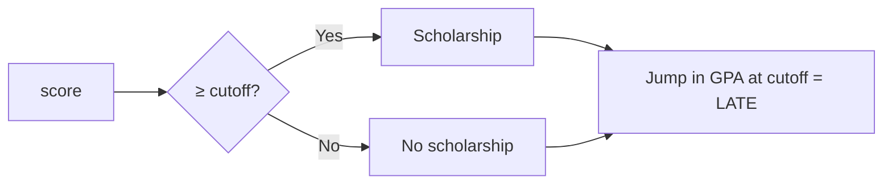

# Example: Effect of a scholarship on academic performance (RDD)

This illustrates [RDD](/en/ecolab/mo-hinh/rdd): a scholarship is awarded to students with an **admission score ≥ cutoff**. Comparing students **just above and just below the cutoff** (as-good-as random) yields a credible causal estimate at the threshold. Figures are **illustrative**.

> Summary: estimate the **jump** in academic performance (next-year GPA) at the score cutoff = the causal effect of the scholarship at the threshold.

---

## Step 1 — Ideation
- **Question:** does receiving the scholarship improve academic performance?

## Step 2 — Literature Review
Impact evaluation of financial aid in education; regression discontinuity design.

## Step 3 — Data Collection

| Role | Variable | Description |
| :--- | :--- | :--- |
| Running variable | `score` | admission score |
| Cutoff | `cutoff` | scholarship threshold |
| Treatment | `scholarship` | 1 if received (sharp: score ≥ cutoff) |
| Outcome | `gpa_next` | next-term/year GPA |

## Step 4 — Modeling

Choose the *Causal inference* family → **RDD** (sharp); declare the running variable, cutoff, bandwidth:

**Illustrative results (format — not real results):**

| | Value |
| :--- | :--- |
| GPA jump at cutoff (LATE) | +0.18*** |
| Optimal bandwidth | ±0.5 points |
| McCrary (p) | 0.42 (no manipulation of the cutoff) |

Sample interpretation: the scholarship **raises GPA by ~0.18** at the threshold; a non-rejected McCrary test ⇒ no sign of score manipulation around the cutoff. This effect is **local to the cutoff** (LATE).

## Step 5 — Reporting
Export a report + the **RDD plot** (scatter + fitted lines on both sides of the cutoff) + **replication code**.

## See also
- [RDD](/en/ecolab/mo-hinh/rdd) · [PSM](/en/ecolab/mo-hinh/psm) · [DiD](/en/ecolab/mo-hinh/did) · [Catalog](/en/ecolab/mo-hinh/danh-muc)
