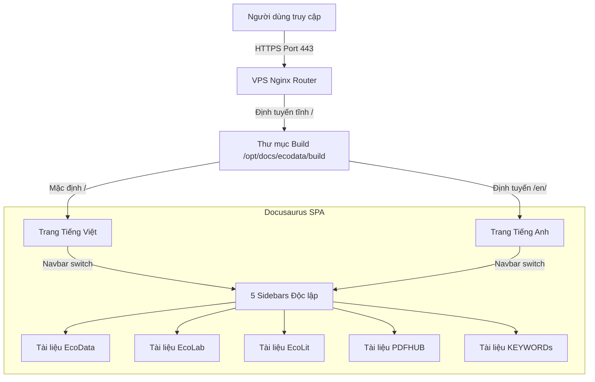

# architecture-map.md - Bản đồ Kiến trúc Trang Tài liệu

Tài liệu này mô tả kiến trúc kỹ thuật của cổng tài liệu hướng dẫn dùng chung `docs.tnsai.vn` tích hợp 5 ứng dụng trong hệ sinh thái TNS AI.

---

## 1. Tổng quan Kiến trúc (System Overview)

Cổng tài liệu được xây dựng dưới dạng một trang web tĩnh (SPA) sử dụng framework **Docusaurus v3**. Trang web được biên dịch tĩnh ở local hoặc VPS và phục vụ trực tiếp bằng **Nginx** thông qua giao thức HTTPS.

---

## 2. Kiến trúc Thư mục và Phân bổ Tài liệu

Dự án sử dụng **1 Instance tài liệu duy nhất** chia thư mục con trong `docs/` để cô lập nội dung và quản lý sidebars thông qua tệp cấu hình trung tâm:

*   **[`/docusaurus.config.js`](file:///d:/docs/docusaurus.config.js)**: Chứa cấu hình chung của site (domain, locales, navbar items, themes, footer).
*   **[`/sidebars.js`](file:///d:/docs/sidebars.js)**: Định nghĩa 5 sidebars tương ứng với 5 ứng dụng. Mỗi sidebar bắt đầu bằng thư mục con tương ứng (ví dụ: `ecodata/overview`, `ecolab/overview`).
*   **Thư mục tài liệu gốc (Tiếng Việt - Mặc định)**:
    *   [`docs/ecodata/`](file:///d:/docs/docs/ecodata/): Tài liệu hướng dẫn sử dụng EcoData.
    *   [`docs/ecolab/`](file:///d:/docs/docs/ecolab/): Tài liệu hướng dẫn sử dụng EcoLab.
    *   [`docs/ecolit/`](file:///d:/docs/docs/ecolit/): Tài liệu hướng dẫn sử dụng EcoLit.
    *   [`docs/pdfhub/`](file:///d:/docs/docs/pdfhub/): Tài liệu hướng dẫn sử dụng PDFHUB.
    *   [`docs/keywords/`](file:///d:/docs/docs/keywords/): Tài liệu hướng dẫn sử dụng KEYWORDs.
*   **Thư mục bản dịch (Tiếng Anh - i18n)**:
    *   [`i18n/en/docusaurus-plugin-content-docs/current/`](file:///d:/docs/i18n/en/docusaurus-plugin-content-docs/current/): Chứa các thư mục con bản dịch tương ứng (`ecodata/`, `ecolab/`, `ecolit/`, `pdfhub/`, `keywords/`).
    *   [`i18n/en/code.json`](file:///d:/docs/i18n/en/docusaurus-plugin-content-docs/current.json): Chứa bản dịch tiếng Anh cho nhãn sidebar và cấu trúc danh mục.

---

## 3. Cơ chế Chuyển đổi Sidebars động (Sidebar Switching Flow)

Để mang lại trải nghiệm premium và học thuật chuyên nghiệp, trang tài liệu không dùng chung 1 sidebar dài mà cô lập sidebar của từng ứng dụng. Việc chuyển đổi được thực hiện hoàn toàn tự động bằng cách map thuộc tính `type: 'docSidebar'` trên Navbar:
1.  Người dùng bấm vào liên kết ứng dụng trên Navbar (ví dụ: "EcoLab").
2.  Docusaurus trỏ tới trang overview tương ứng của app (`/ecolab/overview`).
3.  Hệ thống nhận diện trang này thuộc `ecolabSidebar` và chuyển đổi sidebar bên trái sang sidebar riêng của EcoLab, tạo cảm giác như người dùng đang truy cập một trang tài liệu riêng biệt.
4.  Tất cả các Sidebars đều bắt buộc phải bắt đầu bằng danh mục **"Bắt đầu"** (Getting Started) để giới thiệu các tính năng cốt lõi.
